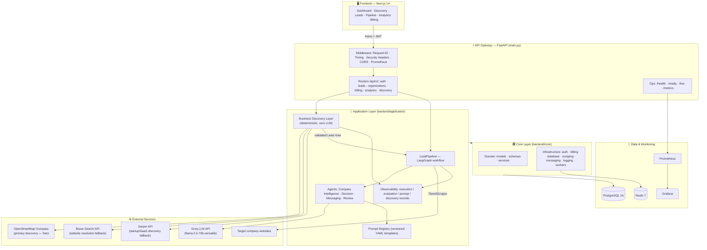
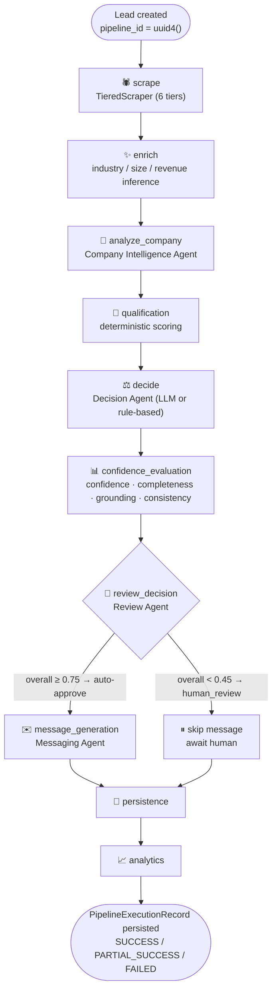
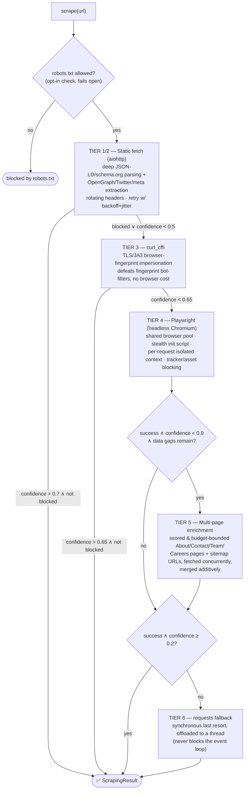

<div align="center">

# LeadBoost AI — Lead Intelligence Platform

**Turn a plain-English search like _"dentists in Bangalore"_ into validated, scored, outreach-ready leads — automatically.**

Full-stack, multi-tenant, subscription-based AI SaaS for automated lead discovery, enrichment, qualification, and outreach generation.

[](https://www.python.org/)
[](https://fastapi.tiangolo.com/)
[](https://langchain-ai.github.io/langgraph/)
[](https://nextjs.org/)
[](https://www.typescriptlang.org/)
[](https://www.postgresql.org/)
[](https://www.docker.com/)
[](.github/workflows/ci.yml)
[](LICENSE)

[Quick Start](#-quick-start) • [Quick Demo](#-quick-demo) • [Architecture](#-system-architecture) • [Scraper Architecture](#-scraper-architecture) • [AI Pipeline](#-ai-lead-pipeline-langgraph) • [API Reference](#-api-reference) • [Docs](#-documentation-index)

</div>

---

## 🚀 Quick Start

### Option A — Docker (recommended)

```bash
git clone <your-fork-url> leadboost && cd leadboost/backend

cp .env.example .env
# Minimum: set SECRET_KEY to something random.
# GROQ_API_KEY / SERPER_API_KEY / BRAVE_API_KEY are OPTIONAL — leaving them
# unset degrades AI features gracefully to deterministic fallbacks; nothing breaks.

docker compose up
```

| Service | URL |
|---|---|
| API | http://localhost:8000 |
| Interactive API docs (Swagger) | http://localhost:8000/docs |
| Health check | http://localhost:8000/health |
| Prometheus metrics | http://localhost:8000/metrics |

The dev compose file starts the **backend (hot-reload)**, **PostgreSQL 16**, and **Redis 7** with health checks and auto-restart. The full monitoring stack (Prometheus, Grafana, pgAdmin) lives in `docker-compose.prod.yml`.

### Option B — Bare metal (no Docker)

```bash
# ── Backend ──────────────────────────────────────────────
cd backend
python -m venv .venv
.venv\Scripts\activate            # Windows   |   source .venv/bin/activate  # macOS/Linux
pip install -r requirements.txt
playwright install chromium       # only needed for the scraper's browser tier

# SQLite is fine for local dev; production requires postgresql://
set DATABASE_URL=sqlite:///./dev.db
python -c "import secrets; print('SECRET_KEY=' + secrets.token_urlsafe(48))" >> .env

uvicorn main:app --reload         # → http://localhost:8000
```

```bash
# ── Frontend ─────────────────────────────────────────────
cd frontend-react
npm install
cp .env.example .env              # NEXT_PUBLIC_API_URL=http://localhost:8000
npm run dev                       # → http://localhost:3000
```

> **Zero-key startup:** the platform boots and works with **no external API keys at all**. Every AI-powered stage has a deterministic fallback, and business discovery uses the free OpenStreetMap Overpass API. Keys only *upgrade* quality — they are never required.

---

## ⚡ Quick Demo

A complete end-to-end run in five `curl` calls — register, log in, discover businesses from a natural-language query, and inspect the resulting leads and pipeline analytics.

```bash
# 1) Register (creates the user, their organization, and a Free-plan subscription)
curl -X POST http://localhost:8000/api/v2/register \
  -H "Content-Type: application/json" \
  -d '{"email":"demo@acme.com","password":"S3cure!pass","full_name":"Demo User","organization_name":"Acme Inc"}'

# 2) Log in → JWT access + refresh tokens
curl -X POST http://localhost:8000/api/v2/login \
  -H "Content-Type: application/json" \
  -d '{"email":"demo@acme.com","password":"S3cure!pass"}'
# → {"access_token":"eyJ...", "refresh_token":"eyJ...", ...}
export TOKEN="eyJ..."   # paste the access_token

# 3) 🔍 Natural-language business discovery — the flagship endpoint.
#    Parses the query, searches OpenStreetMap, resolves & validates each
#    business's real website, dedupes, ranks, creates Leads, and runs every
#    one through the full AI pipeline — synchronously, in one call.
curl -X POST http://localhost:8000/api/v2/discovery/search \
  -H "Authorization: Bearer $TOKEN" -H "Content-Type: application/json" \
  -d '{"query":"Top shoe stores in Mumbai","limit":10}'
# → per-business outcomes: website, resolved_via, pipeline_status (SUCCESS/…)

# 4) Inspect the enriched, scored, outreach-ready leads
curl http://localhost:8000/api/v2/leads/ -H "Authorization: Bearer $TOKEN"

# 5) Pipeline analytics for your organization (success rate, P95 latency, …)
curl "http://localhost:8000/api/v2/analytics/pipeline-metrics?hours=24" \
  -H "Authorization: Bearer $TOKEN"
```

Or use the UI: open **http://localhost:3000**, register, and try the **Discovery** page — type a query, watch businesses stream through validation and the AI pipeline, then explore **Leads**, **Pipeline**, and **Analytics** dashboards.

---

## 📖 Table of Contents

- [What is LeadBoost?](#-what-is-leadboost)
- [Feature Highlights](#-feature-highlights)
- [Technology Stack](#-technology-stack)
- [System Architecture](#-system-architecture)
- [Repository Layout](#-repository-layout)
- [Backend Architecture](#-backend-architecture)
- [Business Discovery Layer](#-business-discovery-layer)
- [AI Lead Pipeline (LangGraph)](#-ai-lead-pipeline-langgraph)
- [Scraper Architecture](#-scraper-architecture)
- [Observability & Analytics](#-observability--analytics)
- [Multi-Tenancy, Auth & Security](#-multi-tenancy-auth--security)
- [Billing & Subscription Plans](#-billing--subscription-plans)
- [Frontend Architecture](#-frontend-architecture)
- [API Reference](#-api-reference)
- [Configuration](#-configuration)
- [Graceful Degradation Matrix](#-graceful-degradation-matrix)
- [Testing](#-testing)
- [CI/CD](#-cicd)
- [Deployment](#-deployment)
- [Documentation Index](#-documentation-index)
- [Project Status & Roadmap](#-project-status--roadmap)
- [License](#-license)

---

## 💡 What is LeadBoost?

LeadBoost answers one question for sales teams: **"Who should I talk to, and what should I say?"**

Given a natural-language query ("AI automation startups in Noida", "Top shoe stores in Mumbai"), LeadBoost:

1. **Discovers** real businesses via structured OpenStreetMap data — deterministically, with no LLM and no search-result scraping.
2. **Resolves and validates** each business's *genuine* official website (never a Facebook page, Yelp listing, or directory).
3. **Scrapes** the website through a six-tier hybrid engine that escalates from cheap static fetches to TLS-fingerprint impersonation to a full headless browser — only paying for heavier tiers when needed.
4. **Enriches & qualifies** the lead through a LangGraph-orchestrated agent pipeline (company intelligence → qualification → decision → confidence evaluation → review gate).
5. **Drafts personalized outreach** for approved leads.
6. **Tracks everything** — per organization, per pipeline run, per prompt version — with usage-based plan limits, structured JSON logging, and Prometheus/Grafana monitoring.

Every step is measured, explainable, and multi-tenant. The result is not a demo: it is a production-shaped SaaS foundation with authentication, organizations, billing enforcement, observability, CI, and deployment paths already built.

---

## ✨ Feature Highlights

| Capability | What it does |
|---|---|
| 🔍 **Natural-language discovery** | "Top cafés in Pune" → parsed by regex (no LLM), searched via OpenStreetMap Overpass, normalized into structured business candidates |
| 🌐 **Website resolution & validation** | Finds the *real* official site; rejects 14+ directory/social domains (Facebook, Yelp, JustDial, …) even after redirects; never fabricates a URL |
| 🕷️ **Six-tier hybrid scraper** | Static → curl_cffi TLS impersonation → Playwright pool → multi-page enrichment → requests fallback, with anti-bot detection and confidence-gated escalation |
| 🤖 **Agentic AI pipeline** | LangGraph workflow with 4 agents (Company Intelligence, Decision, Messaging, Review) — each with an LLM path *and* a deterministic fallback |
| 📊 **Confidence evaluation** | Every decision scored on confidence, completeness, grounding, and consistency; low scores route to a human-review gate instead of auto-messaging |
| ✉️ **Outreach generation** | Personalized first-touch messages using the organization's own identity |
| 🏢 **Multi-tenancy** | Organization-scoped data isolation on every query; JWT auth with refresh tokens; API-key model |
| 💳 **Subscription billing** | Free / Pro / Enterprise tiers, daily lead quotas enforced in real time, AI feature gating per plan (Stripe checkout scaffolded, deliberately not yet wired) |
| 📈 **Deep observability** | Per-stage structured logs, pipeline/evaluation/prompt/discovery execution records, org-scoped analytics API, Prometheus `/metrics`, bundled Grafana dashboard |
| 🧪 **Test coverage & CI** | 30+ test modules; GitHub Actions with lint, type-check, tests, Docker build validation, and dependency security scanning |
| 🛡️ **Fail-fast config validation** | Refuses to boot in production with a placeholder SECRET_KEY, wildcard CORS, or a non-PostgreSQL database |

---

## 🛠 Technology Stack

### Backend

| Layer | Technology |
|---|---|
| Web framework | **FastAPI** (async, OpenAPI auto-docs) + Uvicorn |
| AI orchestration | **LangGraph** (state-machine workflow) + **LangChain** + **Groq** (`llama-3.3-70b-versatile`) |
| ORM / DB | **SQLAlchemy 2.x** → PostgreSQL 16 (prod) / SQLite (dev), Alembic migrations |
| Scraping | **Playwright** (headless Chromium pool), **curl_cffi** (TLS/JA3 impersonation), **aiohttp**, **BeautifulSoup4**, **trafilatura** (main-content extraction) |
| Background jobs | Celery + Redis (legacy orchestrator kept for compatibility; new paths use in-process async pipeline) |
| Auth & security | PyJWT (access + refresh), passlib/bcrypt, python-jose, fail-fast startup validation |
| Resilience | **tenacity** (per-call retry with backoff & jitter) |
| Observability | prometheus_client, python-json-logger (structured JSON logs), Grafana dashboard |
| Billing | Stripe SDK (scaffolded), env-driven plan/limit configuration |
| Validation | Pydantic v2 + email-validator |

### Frontend

| Layer | Technology |
|---|---|
| Framework | **Next.js 14** (App Router) + React 18 + **TypeScript 5.5** |
| Server state | **TanStack React Query 5** (caching, invalidation, optimistic updates) |
| Client state | **Zustand** (auth store) |
| UI system | **Tailwind CSS** + **Radix UI** primitives + CVA variants + `tailwind-merge` |
| Data & forms | TanStack Table, **react-hook-form** + **zod** resolvers |
| Visuals | **Framer Motion** animations, **Recharts** dashboards, Lucide icons, `cmdk` command palette |
| HTTP | Axios with JWT-refresh interceptor |

### Infrastructure

Docker & Docker Compose (dev + prod variants) · Nginx reverse proxy config · Prometheus + Grafana provisioning · GitHub Actions CI · Render/Vercel and self-hosted VPS deployment guides.

---

## 🏗 System Architecture



**Request flow in one sentence:** the Next.js UI calls FastAPI; the Discovery layer deterministically turns a query into validated `Lead` rows; each Lead flows through the LangGraph pipeline (scrape → enrich → qualify → decide → evaluate → review → message); every stage writes structured logs and observability records; analytics endpoints aggregate them per organization.

---

## 📁 Repository Layout

```
LeadBoost-saas-github/
├── backend/
│   ├── main.py                        # FastAPI app: lifespan, middleware, routers, health/metrics
│   ├── api/endpoints/                 # HTTP delivery layer (thin routers)
│   │   ├── auth.py                    #   register / login / refresh / me
│   │   ├── leads.py                   #   lead CRUD + on-demand processing
│   │   ├── organizations.py           #   org management
│   │   ├── billing.py                 #   plans / usage / upgrade
│   │   ├── analytics.py               #   pipeline / evaluation / discovery metrics
│   │   └── discovery.py               #   POST /discovery/search — the flagship endpoint
│   │
│   ├── application/                   # 🧠 AI & orchestration layer
│   │   ├── agents/                    #   CompanyIntelligence · Decision · Messaging · Review
│   │   ├── workflows/                 #   lead_pipeline.py (LangGraph) + graph_nodes.py
│   │   ├── discovery/                 #   deterministic discovery pipeline
│   │   │   ├── providers/             #     Overpass (primary) · Brave · Serper · base ABCs
│   │   │   ├── query_parser.py        #     regex NL parsing — no LLM
│   │   │   ├── business_normalizer.py #     OSM tags → BusinessCandidate (pure)
│   │   │   ├── website_resolver.py    #     find the real official website
│   │   │   ├── website_validator.py   #     reachable + HTML + not a directory
│   │   │   ├── duplicate_detector.py  #     domain / name+phone dedup (pure)
│   │   │   ├── ranking.py             #     deterministic weighted scoring (pure)
│   │   │   └── discovery_service.py   #     orchestrates the whole layer
│   │   ├── prompts/                   #   versioned YAML prompt registry + schemas
│   │   ├── evaluation/                #   confidence / completeness / grounding / consistency
│   │   ├── explainability/            #   human-readable decision explanations
│   │   ├── memory/                    #   DB-backed business memory (AIDecisionLog)
│   │   ├── observability/             #   models · repository · AnalyticsService
│   │   ├── services/                  #   llm_provider (safe_invoke_json) · infra adapters
│   │   ├── state/                     #   LeadState (LangGraph TypedDict state)
│   │   ├── context/ · dto/ · utils/   #   context builder · DTOs · retry · stage_logger
│   │   └── exceptions/
│   │
│   ├── core/                          # 🏛️ Domain + Infrastructure layer
│   │   ├── config.py                  #   fail-fast startup environment validation
│   │   ├── domain/
│   │   │   ├── models/                #   User · Organization · Lead · Subscription · Billing · ApiKey
│   │   │   ├── schemas/               #   Pydantic request/response contracts
│   │   │   └── services/              #   deterministic business services
│   │   ├── infrastructure/
│   │   │   ├── auth/                  #   JWT + password hashing
│   │   │   ├── billing/               #   SubscriptionService · Stripe scaffold
│   │   │   ├── database/              #   engine · session · CRUD
│   │   │   ├── scraping/scraper.py    #   ⭐ 2,150-line six-tier hybrid scraper
│   │   │   ├── enrichment/ messaging/ #   AI enrichment + outreach generation
│   │   │   ├── logging/               #   structured JSON logging
│   │   │   └── workers/               #   legacy Celery orchestrator (kept for compat)
│   │   └── observability/             #   Prometheus metric definitions + renderer
│   │
│   ├── tests/                         # pytest suite (application, discovery, infra, scraper)
│   ├── docs/                          # ARCHITECTURE · DISCOVERY · DEPLOYMENT · DOCKER · ENVIRONMENT · MONITORING
│   ├── monitoring/                    # prometheus.yml + Grafana dashboards/provisioning
│   ├── deploy/nginx.conf              # production reverse proxy
│   ├── docker-compose.yml             # dev: backend + Postgres + Redis
│   ├── docker-compose.prod.yml        # prod: + Prometheus, Grafana, pgAdmin
│   └── Dockerfile                     # multi-stage (builder / Playwright runtime)
│
├── frontend-react/                    # Next.js 14 App Router frontend
│   └── src/
│       ├── app/(auth)/                # login · register · forgot-password
│       ├── app/(app)/                 # dashboard · discovery · leads · pipeline ·
│       │                              # analytics · outreach · billing · organization · settings
│       ├── components/                # ui/ (Radix primitives) · layout · charts · feature components
│       ├── features/                  # per-domain api.ts + React Query hooks
│       ├── lib/                       # api-client (JWT refresh) · validation (zod) · utils
│       ├── store/                     # Zustand auth store
│       └── types/api.ts               # typed API contracts
│
└── .github/workflows/ci.yml           # lint · type-check · tests · Docker build · security scan
```

---

## 🔧 Backend Architecture

The backend follows a **clean-architecture-inspired, three-ring structure** with strict dependency direction: `api → application → core`. Core never imports from Application; Application never imports from API.

| Ring | Directory | Responsibility | Rules |
|---|---|---|---|
| **Delivery** | `api/endpoints/` | HTTP concerns only: routing, auth dependency, request/response schemas | Thin — no business logic |
| **Application** | `application/` | AI agents, LangGraph workflow, discovery pipeline, evaluation, observability | Depends on Core via adapters (`services/infra_adapters.py`); constructor-injected providers |
| **Core** | `core/` | Domain models/schemas/services + infrastructure (DB, auth, billing, scraping, logging) | Zero knowledge of agents or workflows |

Key cross-cutting behaviors implemented in [main.py](backend/main.py):

- **Lifespan management** — fail-fast env validation → DB init with exponential-backoff retry (5 attempts) → subscription plan seeding → graceful shutdown that closes the shared Playwright browser pool and aiohttp session.
- **Middleware stack** — X-Request-ID propagation + response timing, Prometheus counters/histograms labeled by *route template* (never raw paths, preventing label cardinality explosions), security headers (HSTS, X-Frame-Options DENY, nosniff), strict CORS from an explicit allowlist.
- **Global exception handler** — every unhandled error returns a sanitized 500 with the request ID for log correlation; full traceback goes to structured logs only.
- **Kubernetes-style probes** — `/health` (deep: DB + Redis), `/ready` (DB only), `/live` (process only).

### Database models

| Model | Purpose |
|---|---|
| `User` | Authentication identity, belongs to an Organization |
| `Organization` | Tenant boundary — every query is org-scoped |
| `Lead` | 178-line rich model: contact, firmographics, scores, qualification, outreach, pipeline state |
| `Subscription` / `Plan` | Tier assignment and plan definitions |
| `UsageRecord` (billing) | Daily lead-quota tracking |
| `ApiKey` | Programmatic access |
| `PipelineExecutionRecord` · `EvaluationReportRecord` · `PromptExecutionRecord` · `DiscoveryRunRecord` | Additive observability tables (share the same SQLAlchemy `Base`/engine) |

---

## 🔍 Business Discovery Layer

> Full deep-dive: [`backend/docs/DISCOVERY.md`](backend/docs/DISCOVERY.md)

The discovery layer sits *in front of* the AI pipeline and is **100% deterministic — no LLM executes anywhere in it**. Every stage is a pure function or a retried, gracefully-degrading provider call, which makes the whole layer fast, free to run, and independently testable (15 test modules swap in stub providers with zero network calls).

```mermaid
flowchart LR
    Q["POST /api/v2/discovery/search<br/>{query: 'Top shoe stores in Mumbai'}"] --> P["QueryParser<br/>(regex only)"]
    P -->|"category + location + limit"| O["OverpassProvider<br/>category → OSM tag<br/>('shop'='shoes')"]
    O --> N["BusinessNormalizer<br/>(pure: tags → BusinessCandidate)"]
    N --> R["WebsiteResolver"]
    R -->|"has website?"| V["WebsiteValidator<br/>reachable · HTML · not a directory"]
    R -->|"missing/invalid"| B["BraveWebsiteResolver<br/>(fallback, resolution ONLY)"]
    B --> V
    V --> D["DuplicateDetector<br/>(domain, else name+phone)"]
    D --> RK["Ranking<br/>(deterministic weighted score)"]
    RK --> L["Lead creation<br/>(org dedup + quota check)"]
    L --> LP["LeadPipeline.execute()<br/>bounded asyncio concurrency"]
    LP --> RESP["DiscoveryResponse<br/>per-business pipeline_status"]
```



### Provider strategy

| Provider | Role | Why |
|---|---|---|
| **Overpass (OpenStreetMap)** | Primary business search | Free, keyless, returns *structured* tags (name/address/phone/website/category) — no search-result scraping needed. 25+ category→OSM-tag mappings; unmapped categories fall back to name-text search |
| **Brave Search** | Website *resolution only* | Reads only the URL field from Brave's metadata; never scrapes results. Inert (returns `None`) when `BRAVE_API_KEY` is unset |
| **Serper** | Startup/SaaS discovery fallback | For query classes OSM can't answer ("AI automation startups in Noida") |

`DiscoveryService` depends only on the `BusinessSearchProvider` / `WebsiteResolverProvider` ABCs (constructor-injected) — a paid provider like Google Places can be added without touching service logic.

### Website validation — never fabricate, never trust directories

The validator rejects on domain alone (pre-request): `facebook.com`, `instagram.com`, `linkedin.com`, `twitter.com/x.com`, `yelp.com`, `justdial.com`, `indiamart.com`, `tripadvisor.com`, `yellowpages.com`, `google.com`, `youtube.com`, `pinterest.com`, `sulekha.com` — and re-checks the **final landing domain after redirects** (catching dead business domains parked into a directory). Otherwise it requires: reachable, final status 200, `html` content type. A business with no validatable website is reported honestly with `website: null` — **a URL is never invented**.

### Failure isolation

No single business's failure at any stage can 5xx the batch. Overpass outages degrade to `businesses_found: 0` (after 3 retries with backoff); resolution/validation/DB/pipeline failures are caught **per business** and reported as structured outcome reasons. The only intentional 4xx is `QueryParseError` → HTTP 400 (client input error).

---

## 🤖 AI Lead Pipeline (LangGraph)

> Full deep-dive: [`backend/docs/ARCHITECTURE.md`](backend/docs/ARCHITECTURE.md)

Every Lead — whether discovered or manually created — is processed by `LeadPipeline.execute(lead_id)`, a LangGraph `StateGraph` that threads a `pipeline_id` (UUID) through every stage, log line, and observability record.



### The four agents — every one has a deterministic fallback

| Agent | LLM path | Fallback path (no key / LLM failure / free plan) |
|---|---|---|
| **Company Intelligence** | Synthesizes scraped + enriched data into a company profile | Heuristic profile from structured scrape data |
| **Decision** | LLM-driven qualify/reject with reasoning | Rule-based scoring formula |
| **Messaging** | Personalized outreach draft | Template-based message |
| **Review** | — | Fully deterministic gate: `overall ≥ REVIEW_AUTO_APPROVE_THRESHOLD (0.75)` → approve · `< REVIEW_HUMAN_REVIEW_THRESHOLD (0.45)` → human review |

LLM calls go through `safe_invoke_json` ([llm_provider.py](backend/application/services/llm_provider.py)): JSON-schema-validated output, per-invocation `tenacity.Retrying` (isolated retry stats, safe under concurrency), and a returned `retry_count` recorded to both the stage log and `PromptExecutionRecord`.

### Status semantics — honest by design

| Status | Meaning |
|---|---|
| `SUCCESS` | Zero stage exceptions end-to-end |
| `PARTIAL_SUCCESS` | Run completed, but ≥1 stage degraded gracefully to its fallback |
| `FAILED` | Lead not found, or the graph runtime itself raised (safety net — nodes catch their own exceptions) |

A low-confidence or empty result (e.g. a 404 scrape) is **not** an error — only real exceptions count. The status answers *"did the platform work correctly,"* not *"did every lead look impressive."*

### Prompt Registry & versioning

Prompts live as versioned YAML templates ([application/prompts/templates/](backend/application/prompts/templates)). Every LLM-path agent output carries `prompt_name` / `prompt_version` / `retry_count`, and each is persisted to `prompt_execution_logs` — a complete, queryable history of *which prompt version produced which output*, the prerequisite for A/B prompt comparison.

---

## 🕷 Scraper Architecture

> Source: [`backend/core/infrastructure/scraping/scraper.py`](backend/core/infrastructure/scraping/scraper.py) (~2,150 lines)

The `TieredScraper` is LeadBoost's crown-jewel infrastructure: a **hybrid, escalating, cost-aware engine** that extracts company/contact intelligence from static sites, JS-rendered SPAs, and anti-bot-protected pages — while only paying for a heavier tier when a cheaper one fails, gets blocked, or returns low-confidence data.

### Tier escalation model



### Tier reference

| Tier | Engine | Cost | Purpose | Exit condition |
|---|---|---|---|---|
| **1/2** | `aiohttp` + BeautifulSoup | ~free | Single static fetch; JSON-LD/schema.org depth-first parsing; OpenGraph/Twitter/meta; contact extraction | `confidence > 0.7` and not blocked |
| **3** | `curl_cffi` | low | Impersonates a real browser's TLS/JA3 fingerprint — bypasses fingerprint-based bot filters without a browser | `confidence > 0.65` and not blocked |
| **4** | Playwright Chromium | high | Full JS rendering for SPAs; runs the same extraction inside the rendered DOM | best-result comparison |
| **5** | Concurrent sub-page fetches | med | Keyword-scored candidate pages (About/Contact/Team/…) merged with sitemap-discovered URLs, budget-bounded, results merged **additively** (never overwrite better data) | `confidence ≥ 0.9` or budget exhausted |
| **6** | `requests` in a thread | low | Last-resort salvage when everything else scored `< 0.2` | always terminal |

### Anti-bot resilience

- **Header rotation** — pool of 6 realistic User-Agents (Chrome/Edge/Safari/Firefox across Windows/macOS/Linux), rotating `Accept-Language`, `Sec-Fetch-*`, referer simulation.
- **Block detection** — `_looks_blocked()` inspects both HTTP status and body markers (Cloudflare challenges, CAPTCHA walls, "access denied" pages); a blocked page **caps confidence** so the escalator keeps climbing instead of trusting challenge-page HTML.
- **Playwright stealth** — `navigator.webdriver` masking init script, randomized viewport/timezone/locale per context, `--disable-blink-features=AutomationControlled`.
- **Fingerprint-level
