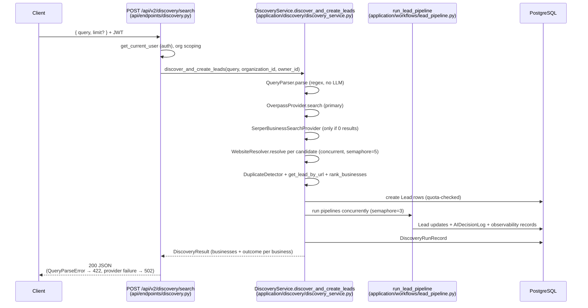
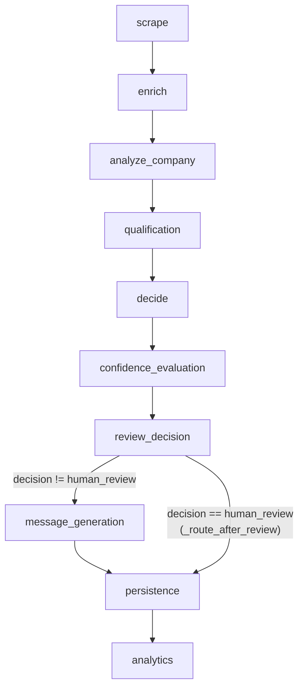

# LeadBoost — Repository Architecture

> Every claim in this document is traceable to a file, class, or function in this
> repository as of the commit it was written against. Where the README describes
> something that could not be located in code, it is flagged explicitly as
> *"described in README but not located in code."* Numbers (thresholds, quotas,
> timeouts) are quoted exactly from source; none are estimated.
>
> Narrower, pre-existing deep-dives live in `backend/docs/`
> (`ARCHITECTURE.md` = observability layer, `DISCOVERY.md` = discovery layer).
> This document covers the whole repository.

---

## 1. System Overview

LeadBoost is a multi-tenant B2B lead-generation platform: a FastAPI backend
(`backend/main.py`) discovers real businesses from OpenStreetMap/Serper search,
turns them into `Lead` rows, and runs each lead through a LangGraph pipeline
(`backend/application/workflows/lead_pipeline.py`) of scraping, enrichment,
AI analysis, scoring, decision, review, and outreach-message generation. Every
AI agent has a deterministic fallback, so the pipeline completes even with no
LLM key configured. A Next.js App Router frontend (`frontend-react/`) consumes
the API; all data access is scoped by `organization_id`.

---

## 2. Repository Layout

| Path | Role |
|---|---|
| `backend/main.py` | FastAPI app factory, lifespan, middleware, health/metrics endpoints |
| `backend/api/endpoints/` | HTTP routers (auth, leads, organizations, billing, analytics, discovery), all mounted at prefix `/api/v2` |
| `backend/application/` | AI application layer: agents, LangGraph workflow, discovery, prompts, evaluation, observability, memory |
| `backend/core/domain/` | SQLAlchemy models, Pydantic schemas, deterministic scoring service |
| `backend/core/infrastructure/` | Database, auth/JWT, scraping, enrichment, messaging, billing (Stripe scaffold), logging, Celery workers (legacy) |
| `backend/core/config.py` | Startup environment validation only (env vars are read at call sites via `os.getenv`, not through a settings object) |
| `frontend-react/src/` | Next.js App Router: `app/(auth)/{login,register,forgot-password}`, `app/(app)/{dashboard,discovery,leads,pipeline,outreach,analytics,billing,organization,profile,settings}`, plus `components/`, `features/`, `hooks/`, `lib/`, `providers/`, `store/`, `types/` |
| `backend/docs/` | Existing deep-dive docs (ARCHITECTURE, DISCOVERY, DEPLOYMENT, DOCKER, ENVIRONMENT, MONITORING) |
| `backend/monitoring/` | Prometheus scrape config + Grafana provisioning/dashboard JSON |

There is no `infra/` directory; deployment assets are `backend/Dockerfile`,
`backend/docker-compose.yml`, `backend/docker-compose.prod.yml`, and
`backend/deploy/nginx.conf`.

---

## 3. Application Startup

`backend/main.py` (`lifespan`):

1. `validate_startup_environment()` (`core/config.py`) — fail-fast checks, see §9.
2. `init_db()` (`core/infrastructure/database/__init__.py`) — retried up to
   **5 attempts** with exponential backoff starting at **2 s**. `init_db()` is
   `Base.metadata.create_all(bind=engine)` — there is **no migration tool**
   (see Known Gaps §10).
3. `SubscriptionService.initialize_plans()` — seeds the `plans` table from env
   (quotas: see §9).
4. On shutdown: `close_scraper_resources()` (shared Playwright browser pool).

Middleware (both in `main.py`): `add_request_id_and_timing` (request ID +
duration; records the `http_requests_total` / `http_request_duration_seconds`
Prometheus metrics, labeled by `prometheus_metrics.route_template(request)`)
and `add_security_headers`.

Non-API endpoints in `main.py`: `/health` (DB ping + Redis ping via
`CELERY_BROKER_URL`), `/ready`, `/live`, `/metrics`
(`prometheus_metrics.render_latest(db)`).

---

## 4. Request Flow (verified end-to-end)

The primary flow — natural-language discovery that ends in processed leads:



The manual path: `POST /api/v2/leads/` (`api/endpoints/leads.py::create_leads`)
accepts up to **100** URLs, deduplicates against existing leads
(`get_lead_by_url`), enforces the daily quota
(`SubscriptionService.check_daily_lead_quota`), inserts `Lead` rows, then
schedules `background_tasks.add_task(run_lead_pipeline, lead.id)` per lead.
`POST /api/v2/leads/{lead_id}/process` re-runs the pipeline synchronously and
requires `can_use_ai_features` (403 otherwise).

Note: the README's quick-demo shows JSON-body login; the actual
`POST /api/v2/auth/login` (`api/endpoints/auth.py`) takes
`OAuth2PasswordRequestForm` form data (`username`/`password`).

---

## 5. Agent / Pipeline Flow

`LeadPipeline._build_graph()` (`application/workflows/lead_pipeline.py`)
registers exactly these LangGraph nodes, whose bodies are the methods of
`LeadPipelineNodes` (`application/workflows/graph_nodes.py`). One conditional
edge exists: `_route_after_review`.



Every node body runs inside `_run_stage` (catches all exceptions → the stage
degrades, the run continues; errors are tallied into
`PARTIAL_SUCCESS`). Agents are invoked via `asyncio.to_thread`.

### LLM path vs. deterministic fallback per node

| Node | Implementation | LLM path (used when `is_llm_available()`) | Deterministic path | `source` value |
|---|---|---|---|---|
| `scrape` | `TieredScraper` (`core/infrastructure/scraping/scraper.py`) | — (never uses LLM) | 6-tier escalation: aiohttp static → structured-data parse → `curl_cffi` TLS impersonation → Playwright → multi-page enrichment → `requests` fallback | — |
| `enrich` | `WaterfallEnricher` (`core/infrastructure/enrichment/enricher.py`) | — | Heuristic enrichment; the external-API step is a **placeholder** returning `None` (lines 156–251). Skipped entirely when `ai_features_enabled=False` | — |
| `analyze_company` | `CompanyIntelligenceAgent` (`application/agents/company_intelligence_agent.py`) | Prompt `company_intelligence` v1, temperature 0.1, max_tokens 700 | Keyword-map industry/tech heuristics; `icp_alignment_score` = fraction of 4 completeness signals present | `llm` / `heuristic` |
| `qualification` | `LeadScoringService` (`core/domain/services/scoring.py`) | — | 6 weighted criteria (see §5.1); label: ≥80 Hot, ≥60 Warm, ≥40 Cold, else Disqualified | — |
| `decide` | `DecisionAgent` (`application/agents/decision_agent.py`) | Prompt `decision` v1, temperature 0.1, max_tokens 500; `_reconcile_action` clamps the LLM's action to equal-or-more-conservative than the rule table | `_ACTION_BY_LABEL`: Hot→proceed, Warm→proceed, Cold→review, Disqualified→reject | `llm` / `rule_based` |
| `confidence_evaluation` | `application/evaluation/evaluators.py` | — (explicitly non-LLM) | `overall = 0.4·confidence + 0.2·completeness + 0.2·grounding + 0.2·consistency` | — |
| `review_decision` | `ReviewAgent` (`application/agents/review_agent.py`) | — (zero LLM calls) | `overall ≥ REVIEW_AUTO_APPROVE_THRESHOLD` (default **0.75**) → `auto_approved`; `≥ REVIEW_HUMAN_REVIEW_THRESHOLD` (default **0.45**) → `flagged`; else `human_review` | — |
| `message_generation` | `MessagingAgent` (`application/agents/messaging_agent.py`) | Prompt `messaging` v1, temperature 0.3, max_tokens 500, single call | `infra_adapters.generate_template_message`. When plan has no AI: fixed message `"No outreach message generated - AI features not available on your plan"` (`graph_nodes.py::_FREE_TIER_MESSAGE`). Skipped when review == `human_review` | `llm` / `template` |
| `persistence` | `graph_nodes.py::persistence` | — | Writes results back to `Lead`, `AIDecisionLog` rows via `SQLBusinessMemory.store`, prompt executions via `observability_repo.create_prompt_execution_record` | — |
| `analytics` | `graph_nodes.py::analytics` | — | Aggregates stage timings into state | — |

LLM plumbing (`application/services/llm_provider.py`): Groq via
`langchain-groq`; `is_llm_available()` = `GROQ_API_KEY` set and not
`"local_test_mode"`; model = `LLM_MODEL` (default `llama-3.3-70b-versatile`);
`safe_invoke_json` retries with tenacity `stop_after_attempt(2)` /
`wait_random_exponential(multiplier=1.0, max=4.0)` and extracts JSON with the
regex `r"\{.*\}"`. It does **not** validate output against a JSON Schema —
the README's "schema-validated" phrasing overstates this (Pydantic DTO
construction is the actual validation step).

Prompt templates: `application/prompts/templates/` contains exactly
`company_intelligence_v1.yaml`, `decision_v1.yaml`, `messaging_v1.yaml`,
loaded by `application/prompts/registry.py`.

Pipeline result status (`lead_pipeline.py`): `SUCCESS` (zero stage errors),
`PARTIAL_SUCCESS` (stage errors but the graph completed), `FAILED` (lead not
found, or the graph runtime itself raised). Each run writes one
`PipelineExecutionRecord`.

### 5.1 Scoring weights (`core/domain/services/scoring.py`)

| Criterion | Weight | Max points |
|---|---|---|
| `industry_match` | 0.25 | 25 |
| `company_size` | 0.20 | 20 |
| `email_quality` | 0.15 | 15 |
| `scrape_quality` | 0.15 | 15 |
| `enrichment_quality` | 0.15 | 15 |
| `linkedin_presence` | 0.10 | 10 |

`_classify_lead`: score ≥ 80 → "Hot Lead", ≥ 60 → "Warm Lead",
≥ 40 → "Cold Lead", else "Disqualified".

---

## 6. Data Model

All models register on the shared `Base` from
`core/infrastructure/database/__init__.py`; `init_db()` creates them via
`create_all`. Fields listed verbatim from the model files.

### `leads` — `Lead` (`core/domain/models/lead.py`)

| Column | Type / notes |
|---|---|
| `id` | Integer PK |
| `organization_id` | FK `organizations.id`, not null |
| `owner_id` | FK `users.id`, not null |
| `company_name`, `industry` | String, nullable |
| `website` | String, **not null** |
| `about_text` | Text |
| `contact_name`, `contact_title`, `email`, `phone`, `address` | String |
| `linkedin_url`, `twitter_url`, `facebook_url` | String |
| `employees`, `revenue_band` | String (banded, e.g. "1-10") |
| `founded_year` | Integer |
| `score` | Float, default 0.0 |
| `qualification_label` | String, default `"Low Priority"` |
| `scrape_confidence`, `email_confidence`, `enrichment_confidence` | Float, default 0.0 |
| `enrichment_source`, `email_source`, `scrape_source` | String, default `"none"` |
| `outreach_message` | Text |
| `outreach_sent` | Boolean, default False |
| `outreach_sent_at` | DateTime |
| `is_active` / `is_verified` | Boolean, defaults True / False |
| `created_at`, `updated_at` | DateTime, server defaults |

### `lead_enrichment_logs` — `LeadEnrichmentLog` (same file)

`id`, `lead_id` (FK), `enrichment_type` (heuristic/llm/external_api),
`enrichment_data` (Text JSON), `confidence_score` (Float, 0.0),
`processing_time_ms` (Integer), `created_at`.

### `scraping_logs` — `ScrapingLog` (same file)

`id`, `lead_id` (FK), `scraping_method`, `success` (default False),
`error_message`, `confidence_score`, `processing_time_ms`, `scraped_data`
(Text JSON), `created_at`.

### `ai_decision_logs` — `AIDecisionLog` (same file)

Audit trail + agent memory + evaluation store (triple purpose per its
docstring): `id`, `lead_id` (FK), `organization_id` (FK), `stage` (indexed),
`agent_name`, `output_data` (Text JSON DTO), `reasoning`, `evidence` (Text
JSON list), `confidence` (Float), `completeness_score`, `grounding_score`,
`consistency_score`, `review_status`, `model_used`, `prompt_name`,
`prompt_version`, `processing_time_ms`, `success` (default True),
`error_message`, `created_at`. Read back by
`application/memory/db_memory.py::SQLBusinessMemory`.

### `organizations` — `Organization` (`core/domain/models/organization.py`)

`id`, `name` (not null), `description`, `plan_tier` (default `"free"`),
`max_users` (default 1), `max_leads` (default 100), `usage_count` (default 0),
`stripe_customer_id`, `stripe_subscription_id`, `is_active` (default True),
`created_at`, `updated_at`.

### `users` — `User` (`core/domain/models/user.py`)

`id`, `email` (unique, indexed, not null), `hashed_password` (not null),
`first_name`, `last_name`, `is_active` (default True), `is_verified`
(default False), `organization_id` (FK, nullable), `created_at`, `updated_at`.

### `subscriptions` — `Subscription` (`core/domain/models/billing.py`)

`id`, `organization_id` (FK, not null), `stripe_subscription_id` (unique, not
null), `plan_name` (not null), `status` (default `"active"`),
`current_period_start`, `current_period_end`, `cancel_at_period_end`
(default False), `created_at`, `updated_at`.

### `usage_records` — `UsageRecord` (same file)

`id`, `organization_id` (FK), `action` (e.g. "lead_scraped"), `quantity`
(default 1), `timestamp`.

### `invoices` — `Invoice` (same file)

`id`, `organization_id` (FK), `stripe_invoice_id` (unique, not null),
`amount` (Float, not null), `currency` (default `"usd"`), `status`
(default `"draft"`), `invoice_pdf`, `created_at`, `due_date`.

### `plans` — `Plan` (`core/domain/models/subscription.py`)

`id`, `name` (unique: free/pro/enterprise), `max_leads_per_day` (not null),
`can_export` (default False), `can_use_ai` (default False), `created_at`,
`updated_at`.

### `api_keys` — `APIKey` (`core/domain/models/api_key.py`)

`id`, `key_hash` (unique, not null), `name`, `key_prefix`, `organization_id`
(FK), `user_id` (FK), `is_active` (default True), `is_revoked`
(default False), `rate_limit` (default 100 requests/min), `created_at`,
`expires_at`. `generate_key()` produces `"lb_" + secrets.token_urlsafe(32)`.
*(Note: no endpoint in `api/endpoints/` currently issues or authenticates API
keys — the model exists, the flow does not.)*

### Observability tables (`application/observability/models.py`)

| Table | Model | Fields |
|---|---|---|
| `pipeline_execution_logs` | `PipelineExecutionRecord` | `pipeline_id` (unique), `lead_id`, `organization_id`, `started_at`, `completed_at`, `duration_ms`, `final_status`, `stage_count`, `error_count`, `created_at` |
| `evaluation_report_logs` | `EvaluationReportRecord` | `pipeline_id`, `lead_id`, `organization_id`, `prompt_version`, `confidence`, `completeness`, `grounding`, `consistency`, `overall`, `evaluated_at` |
| `prompt_execution_logs` | `PromptExecutionRecord` | `pipeline_id`, `lead_id`, `organization_id`, `agent_name`, `prompt_name`, `prompt_version`, `retry_count`, `executed_at` — written only when `source == "llm"` |
| `discovery_run_logs` | `DiscoveryRunRecord` | `organization_id`, `query`, `category`, `location`, `requested_limit`, `businesses_returned`, `businesses_missing_website`, `websites_resolved_via_fallback`, `duplicates_removed`, `validated_leads`, `duration_ms`, `created_at` |

---

## 7. Discovery Layer

Entry: `POST /api/v2/discovery/search` (`api/endpoints/discovery.py`; query
3–200 chars, limit 1–50) → `DiscoveryService.discover_and_create_leads`
(`application/discovery/discovery_service.py`). Chain, in execution order:

1. **`QueryParser.parse`** (`query_parser.py`) — pure regex + fixed gazetteer
   (`locations.py::KNOWN_LOCATIONS`), no LLM. Default limit **20**, max
   **100** (endpoint caps at 50). Rejects placeholder locations ("near me",
   "here", …) with `QueryParseError` → HTTP **422** (the README states 400;
   the code raises 422).
2. **`OverpassProvider.search`** (`providers/overpass_provider.py`) — primary
   business search against `OVERPASS_API_URL` (default
   `https://overpass-api.de/api/interpreter`, timeout 25 s, 3 retry attempts).
   Fixed `_CATEGORY_TAG_MAP` category→OSM-tag table; name-regex fallback for
   unmapped categories. Over-fetches `min(max(limit*3, limit), 200)`.
   Location precision tiers: `original_strict` (administrative boundary) →
   `original_loose` → `alias` (e.g. Bangalore→Bengaluru) → `landmark_stripped`.
3. **`SerperBusinessSearchProvider`** (`providers/serper_provider.py`) — used
   **only when Overpass returns zero candidates**. Filters aggregator domains
   and listicle-style titles.
4. **`WebsiteResolver.resolve`** (`website_resolver.py`) — per candidate,
   concurrently (semaphore `DISCOVERY_MAX_CONCURRENT_RESOLUTIONS`, default
   **5**): Overpass-supplied website → validate; else fallback provider
   (**`SerperWebsiteResolver` by default** — `BraveWebsiteResolver` in
   `providers/brave_provider.py` is injectable but not wired as default);
   else `website=None` ("never fabricate"). Serper scoring gates:
   `_MIN_ACCEPTABLE_SCORE = 15.0`, `_BRAND_GATE_THRESHOLD = 0.55`,
   `_LOW_SIGNAL_BRAND_OVERRIDE = 0.95`, top **5** results considered.
   Without `SERPER_API_KEY` the provider is inert (logs once, returns None).
5. **`WebsiteValidator.validate`** (`website_validator.py`) — single GET with
   1 retry, timeout `DISCOVERY_VALIDATOR_TIMEOUT_SECONDS` (default **15** s);
   accepts statuses `(200, 301, 302)`; requires `text/html`; rejects ~40
   directory/social/marketplace domains (`REJECTED_DOMAINS`) including after
   redirects.
6. **`DuplicateDetector`** (`duplicate_detector.py`) — in-batch dedup keyed on
   normalized domain, falling back to name+phone. Cross-run dedup uses
   `crud.get_lead_by_url` in `DiscoveryService`.
7. **`rank_businesses`** (`ranking.py`) — deterministic points: has-website
   40, category match 20, location match 15, domain/brand match ≤15, rating
   ≤10, review count ≤10, contact completeness ≤15.
8. **Lead creation + pipeline** — quota-checked lead insert, then
   `run_lead_pipeline` per lead, concurrently (semaphore
   `DISCOVERY_MAX_CONCURRENT_PIPELINES`, default **3**). Per-business
   outcomes: `validated`, `duplicate`, `quota_exceeded`, `pipeline_error`,
   `not_selected`, `no_website`, `validation_failed`.
9. **`DiscoveryRunRecord`** written per run.

Known quirk: `DiscoveryService` counts `resolved_via == "brave"` into
`resolved_via_fallback_count`, and the `websites_resolved_via_fallback`
column comment says "Brave successfully resolved" — but the default fallback
is now Serper (`resolved_via == "serper"`), so this counter under-counts in
the default configuration.

---

## 8. Observability — implemented vs. claimed

### Actually implemented

**Prometheus** (`core/observability/prometheus_metrics.py`):
- Live counters/histograms: `http_requests_total`,
  `http_request_duration_seconds` (both labeled by route template, recorded
  in the `main.py` middleware), `auth_attempts_total` (recorded in
  `api/endpoints/auth.py::login`).
- 9 scrape-time gauges refreshed by `refresh_periodic_gauges(db,
  lookback_hours=24)` on each `/metrics` scrape, sourced from
  `AnalyticsService` (pipeline success rate, avg/p95 durations, evaluation
  averages, discovery rates).

**Structured logging** (`core/infrastructure/logging/__init__.py`):
`python-json-logger` JSON formatter to stdout, level from `LOG_LEVEL`
(default `INFO`); helpers `log_api_call`, `log_scraping_attempt`,
`log_enrichment_attempt`; discovery/pipeline modules log with `extra={"event":
...}` structured fields throughout.

**DB-backed metrics**: the four tables in §6, aggregated by
`AnalyticsService` (`application/observability/metrics_service.py`) and
served by `api/endpoints/analytics.py`. Success rate counts `SUCCESS` only
(`PARTIAL_SUCCESS` excluded); p95 uses
`statistics.quantiles(durations, n=100)[94]`.

**Per-stage timing**: `application/utils/stage_logger.py::stage_span` wraps
every graph node (used via `graph_nodes.py::_run_stage`).

**Monitoring config**: `backend/monitoring/prometheus.yml` + Grafana
dashboard/provisioning under `backend/monitoring/grafana/`.

### Claimed but not implemented (or overstated)

| README claim | Reality in code |
|---|---|
| "Alembic migrations" (implied by `alembic` in `requirements.txt`) | No `alembic.ini`, no `alembic/` directory anywhere (verified by glob). Schema comes from `init_db()`'s `create_all`. |
| JWT via `python-jose` (listed in `requirements.txt`) | `core/infrastructure/auth/security.py` does `import jwt` — PyJWT's API. `requirements.txt` itself carries a comment acknowledging this and pinning PyJWT. |
| `safe_invoke_json` output is "JSON-schema-validated" | Extraction is the regex `r"\{.*\}"` + `json.loads`; validation is the Pydantic DTO constructor, not a JSON Schema. |
| `QueryParseError` → HTTP 400 | `api/endpoints/discovery.py` maps it to **422**. |
| Login via JSON body in the README quick-demo | Login is `OAuth2PasswordRequestForm` (form-encoded). |
| Diagrams showing Brave as the website-resolution fallback | Default fallback is `SerperWebsiteResolver`; Brave remains injectable only. |

---

## 9. Configuration

Env vars are read via `os.getenv` at call sites; `core/config.py` only
validates at startup. `ENVIRONMENT=production` turns the "errors" below into
a startup `RuntimeError` (fail-fast in `validate_startup_environment`).

| Variable | Read in | Default | What breaks if missing |
|---|---|---|---|
| `DATABASE_URL` | `core/infrastructure/database/__init__.py` | — | **Import-time `ValueError`** — app cannot start at all. Production additionally requires a `postgresql` URL. |
| `SECRET_KEY` | `core/infrastructure/auth/security.py`, validated in `config.py` | — | Production startup error if unset/placeholder (`"your-super-secret-key-change-in-production"`) or < 32 chars. JWT signing depends on it. |
| `ALLOWED_ORIGINS` | `main.py`, `config.py` | `""` | No CORS origins allowed; production startup error if it contains `*`. |
| `ENVIRONMENT` | `config.py`, `database/__init__.py`, `main.py` | `development` | Controls fail-fast strictness, SQLite tolerance, uvicorn reload. |
| `GROQ_API_KEY` | `application/services/llm_provider.py` | — | All agents use deterministic fallbacks (`source=heuristic/rule_based/template`); startup warning only. |
| `LLM_MODEL` | `llm_provider.py` | `llama-3.3-70b-versatile` | Falls back to default model. |
| `SERPER_API_KEY` | `providers/serper_provider.py` | — | Serper providers inert: no zero-result business fallback, no website fallback resolution. Warning only. |
| `BRAVE_API_KEY` | `providers/brave_provider.py` | — | Only matters if Brave is explicitly injected. |
| `OVERPASS_API_URL` | `providers/overpass_provider.py` | `https://overpass-api.de/api/interpreter` | Uses the public mirror. |
| `DEFAULT_PLAN` | `api/endpoints/auth.py` | `free` | New orgs get the free plan. |
| `FREE_MAX_LEADS_PER_DAY` / `PRO_…` / `ENTERPRISE_…` | `core/infrastructure/billing/subscription_service.py` | **50 / 500 / 10000** | Seeded plan quotas use defaults. |
| `CAN_EXPORT_{FREE,PRO,ENTERPRISE}` / `CAN_USE_AI_{FREE,PRO,ENTERPRISE}` | `subscription_service.py` | all `false` | With all defaults, **no plan has AI features enabled** — `/leads/{id}/process` returns 403 and pipelines take the free-tier message path. |
| `REVIEW_AUTO_APPROVE_THRESHOLD` / `REVIEW_HUMAN_REVIEW_THRESHOLD` | `application/agents/review_agent.py` | `0.75` / `0.45` | Review routing uses defaults. |
| `DISCOVERY_MAX_CONCURRENT_PIPELINES` / `…_RESOLUTIONS` | `discovery_service.py` | `3` / `5` | Concurrency defaults. |
| `DISCOVERY_VALIDATOR_TIMEOUT_SECONDS` | `website_validator.py` | `15` | Validator timeout default. |
| `ACCESS_TOKEN_EXPIRE_MINUTES` / `REFRESH_TOKEN_EXPIRE_DAYS` / `ALGORITHM` | `auth/security.py` | `30` / `7` / `HS256` | Token lifetime/algorithm defaults. |
| `DB_POOL_SIZE` / `DB_MAX_OVERFLOW` / `DB_POOL_RECYCLE` / `DB_POOL_TIMEOUT` / `DB_ECHO` | `database/__init__.py` | `20` / `40` / `3600` / `30` / `false` | Pool tuning defaults. |
| `CELERY_BROKER_URL` / `CELERY_RESULT_BACKEND` | `workers/orchestrator.py`, `/health` in `main.py` | `redis://localhost:6379/0` | `/health` reports Redis unreachable; legacy Celery tasks can't queue. |
| `SCRAPER_MAX_PAGES` / `SCRAPER_MAX_CONCURRENT_PAGES` / `SCRAPER_ENRICHMENT_CONCURRENCY` / `SCRAPER_FETCH_SITEMAP` / `RESPECT_ROBOTS_TXT` | `scraping/scraper.py` | `6` / `4` / `3` / `true` / `false` | Scraper behavior defaults. |
| `STRIPE_SECRET_KEY` / `STRIPE_WEBHOOK_SECRET` | `billing/stripe_service.py` | — | Stripe calls fail — but nothing routes to them today (see §10). Startup warning only. |
| `SENDER_ORG` | `application/context/context_builder.py`, `messaging/messenger.py` | `Our Company` | Outreach messages use the generic sender name. |
| `API_HOST` / `API_PORT` | `main.py` (`__main__` block) | `0.0.0.0` / `8000` | Only affects `python main.py` direct runs. |
| `LOG_LEVEL` | `logging/__init__.py` | `INFO` | Log verbosity default. |

---

## 10. Known Gaps

- **No database migrations** — `requirements.txt` pins `alembic`, but there is
  no `alembic.ini`, `alembic/` directory, or `env.py` anywhere in the repo.
  Schema evolution relies entirely on `init_db()`'s `create_all`, which never
  alters existing tables.
- **Billing is scaffolded but deliberately unwired** —
  `core/infrastructure/billing/stripe_service.py` implements customers,
  subscriptions, webhooks, and a billing portal, but no router ever calls it
  and no webhook endpoint is registered.
  `api/endpoints/billing.py::upgrade_plan` intentionally returns **402
  "Online payments coming soon."** without changing the plan (its docstring
  explains that wiring `assign_plan_to_organization` here without payment
  verification would let any user unlock paid plans for free). Stripe's
  `_handle_payment_succeeded` / `_handle_payment_failed` are literal `pass`
  stubs, and `_get_plan_name_from_id` maps placeholder price IDs
  (`price_123`/`price_456`/`price_789`).
- **External-API enrichment is a placeholder** —
  `core/infrastructure/enrichment/enricher.py::_external_api_enrichment`
  (lines ~156–251) is commented "placeholder implementation … would call
  Clearbit, Apollo, etc." and always returns `None`.
- **Celery orchestrator is legacy/orphaned** —
  `core/infrastructure/workers/orchestrator.py` defines
  `process_lead_task` (max_retries=3), but nothing outside that file calls
  it; the live path is FastAPI `BackgroundTasks` + `run_lead_pipeline`
  (`lead_pipeline.py`'s own comments reference replacing the old
  `process_lead_task` flow). Redis/Celery remain in `/health` checks and
  requirements.
- **API keys have a model but no flow** — `core/domain/models/api_key.py`
  exists with hashing/prefix/rate-limit fields, but no endpoint issues,
  lists, or authenticates with API keys.
- **Fallback-resolution counter mislabeled** — `DiscoveryRunRecord.
  websites_resolved_via_fallback` is documented as "Brave successfully
  resolved" and `DiscoveryService` counts only `resolved_via == "brave"`,
  while the default fallback provider is Serper — the counter stays 0 in the
  default configuration.
- **requirements/import mismatches (self-documented)** — `requirements.txt`
  notes that `security.py` uses PyJWT (not the listed `python-jose`) and that
  `email-validator` is required for the app to import at all.
- **Organization creation quirk** — `api/endpoints/organizations.py::
  create_org` re-assigns the *current user's* `organization_id` to the newly
  created org, silently detaching them from their previous organization.
- **`/billing` frontend page + `outreach`/`pipeline` pages** exist in
  `frontend-react/src/app/(app)/`, but backend support is limited to what §4
  and §10 describe (e.g. upgrade always 402).

---

## 11. File Reference Table

One line per file, taken from each file's actual docstring/class definitions.

| Path (under `backend/`) | Responsibility |
|---|---|
| `main.py` | FastAPI app, lifespan (env validation, DB init retry, plan seeding), middleware, health/metrics |
| `core/config.py` | `validate_startup_environment()` — fail-fast env validation, production strictness |
| `api/endpoints/auth.py` | Register (org+user+plan, atomic), OAuth2 form login, refresh, `/me` |
| `api/endpoints/leads.py` | Bulk (≤100) and single lead creation, list/get/update/delete, synchronous `/process` |
| `api/endpoints/discovery.py` | `POST /discovery/search` — natural-language discovery endpoint |
| `api/endpoints/organizations.py` | Organization CRUD (create/get/update) |
| `api/endpoints/billing.py` | Plan/usage info; `upgrade` deliberately returns 402 |
| `api/endpoints/analytics.py` | Pipeline/evaluation/discovery metrics endpoints backed by `AnalyticsService` |
| `application/dependencies.py` | Dependency wiring for application-layer services |
| `application/dto/models.py` | Pydantic DTOs; every agent output embeds reasoning/evidence/confidence (`Explanation`) |
| `application/workflows/lead_pipeline.py` | `LeadPipeline` — LangGraph StateGraph build + `run_lead_pipeline` entry, status semantics |
| `application/workflows/graph_nodes.py` | `LeadPipelineNodes` — the 10 node bodies, `_run_stage` error isolation, free-tier gating |
| `application/agents/base.py` | Shared agent base |
| `application/agents/company_intelligence_agent.py` | Company analysis: LLM prompt or keyword-map heuristics |
| `application/agents/decision_agent.py` | Qualification→action: rule table + LLM reconciled conservatively |
| `application/agents/messaging_agent.py` | Outreach message: LLM prompt or template fallback |
| `application/agents/review_agent.py` | Threshold-based routing (no LLM): auto_approved/flagged/human_review |
| `application/services/llm_provider.py` | Groq client, `is_llm_available`, `safe_invoke_json` (tenacity retry, regex JSON extraction) |
| `application/services/infra_adapters.py` | Adapters over infrastructure (scraper/enricher/messenger) for the application layer |
| `application/context/context_builder.py` | Builds per-lead prompt context (incl. `SENDER_ORG`) |
| `application/prompts/registry.py` | Versioned YAML prompt template loading |
| `application/prompts/schemas.py` | Prompt template schema definitions |
| `application/evaluation/evaluators.py` | Deterministic confidence/completeness/grounding/consistency scoring |
| `application/explainability/explainer.py` | Explanation envelope helpers |
| `application/memory/db_memory.py` | `SQLBusinessMemory` — reads/writes `ai_decision_logs` as agent memory |
| `application/memory/interfaces.py` | Memory port definitions |
| `application/interfaces/ports.py` | Application-layer port interfaces |
| `application/state/lead_state.py` | LangGraph `LeadState` TypedDict |
| `application/utils/retry.py` | Generic `with_retry` decorator (tenacity-based) |
| `application/utils/stage_logger.py` | `stage_span` per-stage timing/logging context manager |
| `application/exceptions/errors.py` | Application-layer exception types |
| `application/observability/models.py` | 4 additive metric tables (pipeline/evaluation/prompt/discovery logs) |
| `application/observability/repository.py` | Write-side repository for observability records |
| `application/observability/metrics_service.py` | `AnalyticsService` — aggregation queries (success rate, p95, discovery rates) |
| `application/discovery/discovery_service.py` | Discovery orchestration: parse→search→resolve→dedup→rank→create→pipeline→record |
| `application/discovery/query_parser.py` | Regex/gazetteer query parsing (no LLM), placeholder-location rejection |
| `application/discovery/locations.py` | `KNOWN_LOCATIONS` gazetteer, aliases, landmark stripping |
| `application/discovery/website_resolver.py` | Website resolution priority: Overpass → fallback provider → None (never fabricate) |
| `application/discovery/website_validator.py` | Cheap reachability/sanity check, ~40 rejected directory/social domains |
| `application/discovery/duplicate_detector.py` | In-batch dedup by domain, then name+phone |
| `application/discovery/ranking.py` | Deterministic multi-signal business scoring |
| `application/discovery/grounding.py` | Brand/domain match strength, low-signal-name detection |
| `application/discovery/business_normalizer.py` | Overpass element → `BusinessCandidate` normalization |
| `application/discovery/dto.py` | Discovery dataclasses (`ParsedQuery`, `BusinessCandidate`, `WebsiteResolution`, …) |
| `application/discovery/exceptions.py` | `QueryParseError`, `ProviderError`, … |
| `application/discovery/providers/base.py` | `BusinessSearchProvider` / `WebsiteResolverProvider` interfaces |
| `application/discovery/providers/overpass_provider.py` | Primary OSM business search, location-precision tiers |
| `application/discovery/providers/serper_provider.py` | Serper website resolution (default fallback) + zero-result business search |
| `application/discovery/providers/brave_provider.py` | Brave website resolution (injectable alternative, not default) |
| `application/discovery/providers/http_utils.py` | Shared provider HTTP helpers |
| `core/domain/models/{lead,organization,user,billing,subscription,api_key}.py` | SQLAlchemy models (§6) |
| `core/domain/schemas/` | Pydantic request/response schemas (user schema uses `EmailStr`) |
| `core/domain/services/scoring.py` | `LeadScoringService` — 6-criteria weighted scoring + classification |
| `core/infrastructure/database/__init__.py` | Engine/session/`Base`, pool config, `init_db()` via `create_all` |
| `core/infrastructure/database/crud.py` | CRUD helpers (`get_lead_by_url`, subscriptions, orgs, …) |
| `core/infrastructure/auth/security.py` | PyJWT tokens (HS256, 30 min access / 7 day refresh), bcrypt hashing, `get_current_user` |
| `core/infrastructure/scraping/scraper.py` | `TieredScraper` — 6-tier escalating scrape (aiohttp → curl_cffi → Playwright → multi-page → requests) |
| `core/infrastructure/enrichment/enricher.py` | `WaterfallEnricher` — heuristics; external-API step is a placeholder |
| `core/infrastructure/messaging/messenger.py` | Template-based outreach message generation |
| `core/infrastructure/billing/subscription_service.py` | Plan seeding from env, daily-quota checks, `_effective_plan_name` (canceled→free) |
| `core/infrastructure/billing/stripe_service.py` | Stripe scaffold (unwired; see §10) |
| `core/infrastructure/workers/orchestrator.py` | Legacy Celery task (`process_lead_task`) — not called by any endpoint |
| `core/infrastructure/logging/__init__.py` | JSON structured logging setup + domain log helpers |
| `core/observability/prometheus_metrics.py` | Prometheus counters/histograms + 9 scrape-time gauges |
| `tests/` | pytest suites: application (pipeline, agents, discovery ×15 files, billing, observability, isolation), infrastructure, scraper |

Frontend (`frontend-react/src/`): App Router route groups `(auth)` and
`(app)` with pages listed in §2; feature modules under `features/{analytics,
auth, billing, discovery, leads, organizations}`; API client and state in
`lib/`, `store/`, `providers/`.

---

## 12. How this document stays accurate

There is no generator script in the repo; this document was produced by
manual code reading. To re-validate its most drift-prone claims:

- **Env vars (§9)** — re-run the scan this doc was built from (PowerShell):
  ```powershell
  Get-ChildItem -Recurse -Filter *.py backend | Where-Object { $_.FullName -notmatch '__pycache__' } |
    Select-String -Pattern 'os\.getenv\(\s*"([A-Z0-9_]+)"' -AllMatches |
    ForEach-Object { $_.Matches | ForEach-Object { $_.Groups[1].Value } } | Sort-Object -Unique
  ```
- **Graph nodes (§5)** — grep `add_node(` in
  `backend/application/workflows/lead_pipeline.py`; the Mermaid diagram must
  list exactly those names.
- **Prometheus metrics (§8)** — grep `Counter(|Histogram(|Gauge(` in
  `backend/core/observability/prometheus_metrics.py`.
- **Models (§6)** — grep `__tablename__` under `backend/core/domain/models/`
  and `backend/application/observability/models.py`.
- **Behavioral claims** — the test suite pins many of them
  (`backend/tests/application/` covers pipeline routing, review thresholds,
  discovery, quotas, org isolation): run `pytest` from `backend/`.

Any diff in those scans against §§5–9 means this document needs an update.
