# LeadBoost Backend — Full Architecture & Workflow Reference

> Code-grounded architecture document for `backend/`. Every claim below is traceable to real
> files and functions; constants are quoted verbatim from source. `backend/scripts/` and
> `backend/tests/` are intentionally excluded per scope.

---

## Table of Contents

1. [System Overview](#1-system-overview)
2. [Layered Architecture Diagram](#2-layered-architecture-diagram)
3. [Entry Point — `main.py`](#3-entry-point--mainpy)
4. [Configuration — `core/config.py`](#4-configuration--coreconfigpy)
5. [API Layer — `api/endpoints/`](#5-api-layer--apiendpoints)
6. [The "Top shoe stores in Mumbai" End-to-End Workflow](#6-the-top-shoe-stores-in-mumbai-end-to-end-workflow)
7. [Discovery Subsystem — `application/discovery/`](#7-discovery-subsystem--applicationdiscovery)
8. [Digital Identity Pipeline — Sprints 1-4 Deep Dive](#8-digital-identity-pipeline--sprints-1-4-deep-dive)
9. [Discovery Evaluation Harness — `discovery_eval/`](#9-discovery-evaluation-harness--discovery_eval)
10. [AI Lead Pipeline — `application/workflows/` + agents](#10-ai-lead-pipeline--applicationworkflows--agents)
11. [Application Support Modules](#11-application-support-modules)
12. [Core Domain — `core/domain/`](#12-core-domain--coredomain)
13. [Core Infrastructure — `core/infrastructure/`](#13-core-infrastructure--coreinfrastructure)
14. [Observability — metrics, logging, analytics](#14-observability--metrics-logging-analytics)
15. [Database Schema (ER Diagram)](#15-database-schema-er-diagram)
16. [Full Per-File Responsibility Table](#16-full-per-file-responsibility-table)
17. [Inter-File Dependency Map](#17-inter-file-dependency-map)
18. [Testing Layout — `tests/`](#18-testing-layout--tests)
19. [Diagram Tooling — Why SVG Instead of Mermaid for Large Diagrams](#19-diagram-tooling--why-svg-instead-of-mermaid-for-large-diagrams)
20. [Known Gaps & Intentional Stubs](#20-known-gaps--intentional-stubs)

---
## 1. System Overview

LeadBoost is a multi-tenant B2B lead-generation SaaS backend. It has **two major workflows**:

1. **Business Discovery** (deterministic, LLM-free): a natural-language query such as
   *"Top shoe stores in Mumbai"* is parsed, real businesses are found via OpenStreetMap
   (Overpass API) with a Google-Serper fallback, websites are resolved and validated,
   duplicates removed, results ranked deterministically, and Leads created in the database.
2. **AI Lead Pipeline** (LangGraph-orchestrated): each created Lead is processed through a
   10-node graph — scrape → enrich → company intelligence → qualification scoring →
   decision → confidence evaluation → review gating → message generation → persistence →
   analytics. Every LLM-backed agent has a deterministic fallback, so the pipeline
   completes even without a `GROQ_API_KEY`.

Key technologies (verified in code): **FastAPI** ("LeadBoost SaaS API" v2.0.0),
**SQLAlchemy** (PostgreSQL prod / SQLite dev), **LangGraph + LangChain + Groq**
(`llama-3.3-70b-versatile` default), **aiohttp / curl_cffi / Playwright** tiered scraping,
**Prometheus** metrics, JWT auth (30-min access tokens), org-scoped multi-tenancy, and
plan-based feature gating (free / pro / enterprise).

### Architectural style

Clean layering with dependency direction `api → application → core`:

- `api/endpoints/` — HTTP routes only (auth checks, validation, delegation).
- `application/` — use-cases: discovery service, LangGraph pipeline, agents, prompts,
  evaluation, memory, observability records. Talks to `core` via `services/infra_adapters.py`.
- `core/domain/` — SQLAlchemy models, Pydantic schemas, deterministic scoring service.
- `core/infrastructure/` — DB engine/CRUD, auth/JWT, billing, scraping, enrichment,
  messaging, normalization, logging, (dormant) Celery worker.

### Discovery Quality Refinement (Sprints 1-4)

Layered underneath Business Discovery's deterministic pipeline is a second, internal-only
pipeline that turns a resolved website into a scored, explainable **digital identity**:
`evidence.py` -> `features.py` -> `verification.py` -> `confidence.py` -> `identity.py` ->
`identity_resolution_engine.py` (built on `canonicalization.py` / `organization.py` /
`competition.py` / `reliability.py` / `false_positive.py`) -> `digital_identity.py`. It never
changes what the discovery API returns to existing callers -- it is consumed additively by
`ranking.py` (better scoring when available, byte-for-byte unchanged fallback when not) and is
now on the live request path via `WebsiteResolver.resolve_with_digital_identity()`. Full deep
dive in §8, offline benchmark harness in §9.

---
## 2. Layered Architecture Diagram

```mermaid
graph TB
    subgraph Clients
        FE["Next.js Frontend"]
        PROM["Prometheus scraper"]
    end

    subgraph "Gateway — main.py"
        MW["Middleware: request-id + timing,<br/>security headers, CORS"]
        HEALTH["/health /ready /live /metrics"]
    end

    subgraph "API Layer — api/endpoints/ (all under /api/v2)"
        AUTH_EP["auth.py<br/>register/login/refresh/me"]
        LEADS_EP["leads.py<br/>CRUD + batch + /process"]
        DISC_EP["discovery.py<br/>POST /discovery/search"]
        BILL_EP["billing.py<br/>usage/upgrade/plans/cancel"]
        ANA_EP["analytics.py<br/>pipeline/eval/discovery metrics"]
        ORG_EP["organizations.py<br/>org CRUD"]
    end

    subgraph "Application Layer — application/"
        DISCS["discovery/<br/>DiscoveryService + providers"]
        PIPE["workflows/<br/>LangGraph LeadPipeline"]
        AGENTS["agents/<br/>4 AI agents"]
        PROMPTS["prompts/<br/>versioned YAML registry"]
        EVAL["evaluation + explainability"]
        MEM["memory/<br/>SQLBusinessMemory"]
        OBS["observability/<br/>run records + AnalyticsService"]
        ADAPT["services/infra_adapters.py<br/>(bridge to core)"]
    end

    subgraph "Core Domain — core/domain/"
        MODELS["models/ (SQLAlchemy)"]
        SCHEMAS["schemas/ (Pydantic)"]
        SCORING["services/scoring.py"]
    end

    subgraph "Core Infrastructure — core/infrastructure/"
        DB["database/ engine + CRUD"]
        SEC["auth/security.py JWT"]
        BILLS["billing/ subscription + stripe"]
        SCRAPE["scraping/ TieredScraper"]
        ENRICH["enrichment/ WaterfallEnricher"]
        NORM["normalization/normalizer.py"]
        MSG["messaging/messenger.py"]
        LOGS["logging/ JSON logger"]
        CELERY["workers/orchestrator.py (dormant)"]
    end

    subgraph External
        OSM["Overpass API (OpenStreetMap)"]
        SERPER["Serper.dev (Google Search)"]
        GROQ["Groq LLM API"]
        STRIPE["Stripe (partially wired)"]
        PG["PostgreSQL"]
        REDIS["Redis (health check / celery broker)"]
    end

    FE --> MW --> AUTH_EP & LEADS_EP & DISC_EP & BILL_EP & ANA_EP & ORG_EP
    PROM --> HEALTH
    DISC_EP --> DISCS
    LEADS_EP --> PIPE
    ANA_EP --> OBS
    AUTH_EP --> SEC
    BILL_EP --> BILLS
    DISCS --> OSM & SERPER
    DISCS --> PIPE
    PIPE --> AGENTS --> PROMPTS
    AGENTS --> GROQ
    PIPE --> EVAL & MEM & OBS
    PIPE --> ADAPT
    ADAPT --> SCRAPE & ENRICH & SCORING & MSG & BILLS
    ENRICH --> NORM
    DISCS & PIPE & AUTH_EP --> DB
    BILLS --> STRIPE
    DB --> PG
    HEALTH --> REDIS
```

---

## 3. Entry Point — `main.py`

**Responsibility:** FastAPI application gateway. Owns app creation, lifespan, middleware,
health probes, the Prometheus endpoint, and router registration. Contains no business logic.

### 3.1 Startup / shutdown (lifespan)

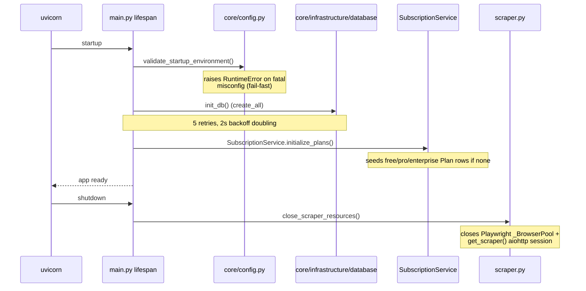

### 3.2 Middleware chain (order matters)

| Middleware | What it does |
|---|---|
| `add_request_id_and_timing` | Generates `X-Request-ID`, measures duration, sets `X-Response-Time`, increments Prometheus `http_requests_total` / observes `http_request_duration_seconds` labeled by **route template** (via `prometheus_metrics.route_template`, bounding label cardinality) |
| `add_security_headers` | `X-Content-Type-Options: nosniff`, `X-Frame-Options: DENY`, HSTS `max-age=31536000` |
| CORS | Origins from `ALLOWED_ORIGINS` env, `max_age=600` |
| Global exception handler | Any unhandled error → HTTP 500 with the request_id in the body |

### 3.3 Operational endpoints

| Endpoint | Behavior |
|---|---|
| `GET /health` | DB `SELECT 1` + Redis ping (URL from `CELERY_BROKER_URL`, default `redis://localhost:6379/0`); **503** if either unhealthy |
| `GET /ready` | readiness probe |
| `GET /live` | liveness probe |
| `GET /metrics` | **Unauthenticated by design**; `prometheus_metrics.render_latest(db)` — refreshes scrape-time gauges then renders |

### 3.4 Server & routers

- Uvicorn: `API_HOST` (default `0.0.0.0`), `API_PORT` (default `8000`), auto-reload only when
  `ENVIRONMENT=development`.
- Routers all mounted at prefix **`/api/v2`**: `auth`, `leads`, `organizations`, `billing`,
  `analytics`, `discovery`.

---

## 4. Configuration — `core/config.py`

**Responsibility:** NOT a settings class. A single fail-fast function
`validate_startup_environment()` called once from the lifespan. Env vars are otherwise read
at their call sites throughout the codebase.

**Fatal in production** (raises aggregated `RuntimeError`):

- `SECRET_KEY` equals the insecure default `"your-super-secret-key-change-in-production"`
- `SECRET_KEY` shorter than 32 chars
- `DATABASE_URL` not `postgresql://…`
- `*` present in `ALLOWED_ORIGINS`

**Warning-only** (logged, never raises): missing `GROQ_API_KEY`, `SERPER_API_KEY`,
`STRIPE_SECRET_KEY` — the system degrades gracefully without each of them.

---

## 5. API Layer — `api/endpoints/`

Every endpoint uses `Depends(get_db)` (request-scoped session from
`core/infrastructure/database`) and `Depends(get_current_active_user)` (JWT chain from
`core/infrastructure/auth/security.py`) unless noted. All organization access is checked
against `current_user.organization_id` (multi-tenant isolation).

### 5.1 `auth.py` (no sub-prefix)

| Route | Behavior |
|---|---|
| `POST /register` | **Atomic**: creates `Organization` named `"{first_name}'s Organization"` + `User` + default subscription plan from `DEFAULT_PLAN` env (default `"free"`) |
| `POST /login` | OAuth2 form; issues 30-min access token + refresh token; increments `auth_attempts_total{result}`; 401 on bad credentials or inactive user |
| `POST /refresh` | Requires JWT with `token_type == "refresh"`; issues new access token |
| `GET /me`, `PUT /me` | Current-user profile read/update |

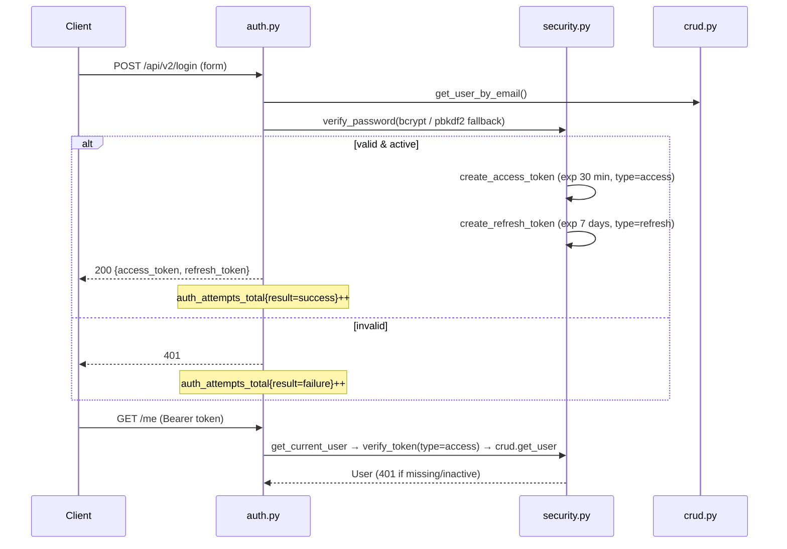

### 5.2 `leads.py` (prefix `/leads`)

| Route | Behavior |
|---|---|
| `POST /` | **Batch create**: max 100 URLs (400 above), dedupe + lowercase, quota check via `SubscriptionService.can_create_lead` (429 `"Daily lead limit exceeded"`), then `background_tasks.add_task(run_lead_pipeline, lead.id)` per lead |
| `POST /single` | Single-lead variant of the above |
| `GET /` | Paginated list (skip ≥ 0, limit 1–1000, default 100), org-scoped |
| `GET /{lead_id}` | 404 if absent, 403 if other org |
| `PUT /{lead_id}` | Field update via `LeadUpdate` schema |
| `DELETE /{lead_id}` | **Soft delete** (`is_active=False`) |
| `POST /{lead_id}/process` | 403 unless `can_use_ai_features`; **awaits** `run_lead_pipeline(lead_id)` synchronously and returns the `PipelineResult` |

### 5.3 `discovery.py` (prefix `/discovery`)

| Route | Behavior |
|---|---|
| `POST /search` | Body `DiscoverySearchRequest`: `query` (min_length=3, max_length=200, documented example is literally `"Top shoe stores in Mumbai"`), `limit` (1–50). Calls `DiscoveryService.discover_and_create_leads(query, organization_id, owner_id, limit)`. `QueryParseError` → **422**; provider/other failures → **502** |

### 5.4 `billing.py` (no sub-prefix)

| Route | Behavior |
|---|---|
| `GET /usage` | `SubscriptionService.get_organization_usage` → `PlanUsage` DTO |
| `POST /upgrade` | **Intentional stub** → HTTP **402** `"Online payments coming soon."`; validates plan ∈ {free, pro, enterprise} first |
| `GET /plans` | Lists the 3 seeded plans |
| `POST /cancel` | `SubscriptionService.cancel_subscription` (immediate or at period end) |

### 5.5 `analytics.py` (prefix `/analytics`)

| Route | Behavior |
|---|---|
| `GET /pipeline-metrics` | `AnalyticsService.get_pipeline_metrics` (optional `hours` window) |
| `GET /evaluation-metrics` | `AnalyticsService.get_evaluation_metrics` |
| `GET /discovery-metrics` | `AnalyticsService.get_discovery_metrics` |

### 5.6 `organizations.py` (prefix `/organizations`)

`POST /`, `GET /`, `GET /{org_id}`, `PUT /{org_id}` — strict membership checks: any access to
an org the current user doesn't belong to → **403**.

---

## 6. The "Top shoe stores in Mumbai" End-to-End Workflow

This is the complete file-by-file trace of what happens when a user submits
`POST /api/v2/discovery/search` with `{"query": "Top shoe stores in Mumbai", "limit": 10}`.

### 6.1 Master sequence diagram

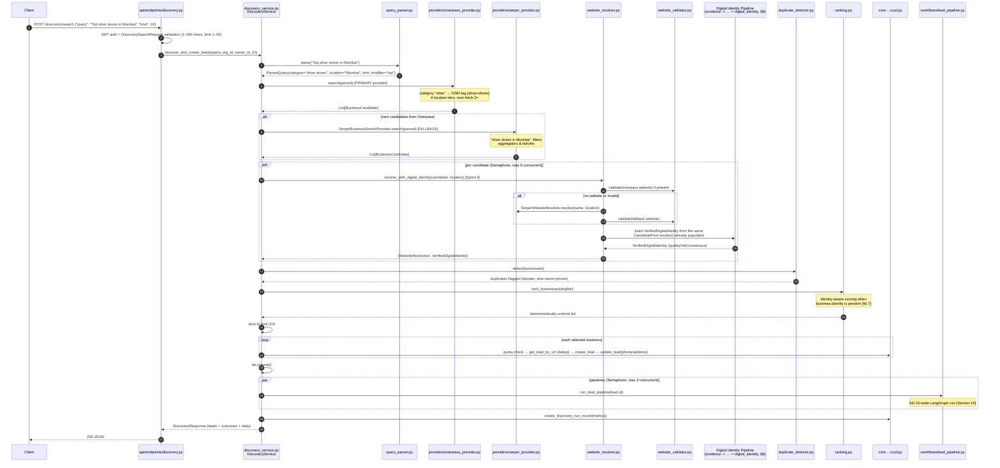

> **Why the identity pipeline is one box, not expanded inline:** `resolve_with_digital_identity()`
> internally runs 12 further modules (Evidence → Features → Verification → Confidence → Identity →
> Identity Resolution Engine → Digital Identity — see §8). Inlining all of that into this sequence
> diagram the way the rest of the flow is drawn would make the diagram unreadable in GitHub's Mermaid
> renderer (see §19 for why large diagrams in this document use pre-rendered SVG instead). §8 has the
> dedicated data-flow diagram for what happens inside the `DI` participant above.

### 6.2 Step 1 — HTTP entry: `api/endpoints/discovery.py`

- FastAPI validates `DiscoverySearchRequest` (`query` 3–200 chars, `limit` 1–50).
- Auth: `get_current_active_user` resolves the JWT → user → `organization_id`, `owner_id`.
- Delegates entirely to `DiscoveryService`; maps `QueryParseError` → 422, anything else → 502.

### 6.3 Step 2 — Query parsing: `application/discovery/query_parser.py`

Deterministic regex + gazetteer parser (no LLM). Constants: `_DEFAULT_LIMIT = 20`,
`_MAX_LIMIT = 100`.

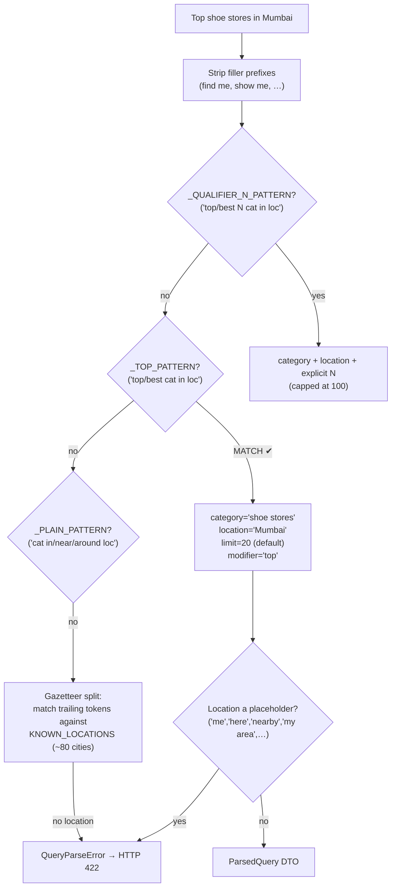

Additional behaviors: prepositions recognized are `located in | situated in | close to |
around | near | in`; a trailing `"for X"` purpose qualifier is folded into the category.
`locations.py` supplies `LOCATION_ALIASES` (12 entries, e.g. `bangalore→Bengaluru`,
`bombay→Mumbai`), `_LANDMARK_SUFFIXES`, and `KNOWN_LOCATIONS` (~80 cities).

For our query: **`_TOP_PATTERN` matches → `ParsedQuery(category="shoe stores",
location="Mumbai", limit=20, modifier="top")`**.

### 6.4 Step 3 — Business search: Overpass primary, Serper fallback

`DiscoveryService._search` tries `OverpassProvider` first; the
`SerperBusinessSearchProvider` fallback fires **only when Overpass returns zero candidates**.

#### `providers/overpass_provider.py`

- `_CATEGORY_TAG_MAP` (~40 entries) maps `"shoe"` → OSM tag `("shop", "shoes")`.
- Default endpoint `https://overpass-api.de/api/interpreter` (env `OVERPASS_API_URL`);
  HTTP timeout **25s**, in-query Overpass timeout **20s**.
- Over-fetches **3× the requested limit, capped at 200** raw elements.
- Retry: 3 attempts, exponential wait 1.0–5.0s.
- Tries up to **4 location tiers** until one yields results:

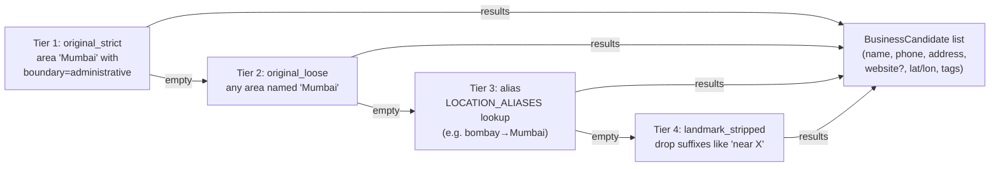

#### `providers/serper_provider.py` — `SerperBusinessSearchProvider` (fallback)

- Query template `"{category} in {location}"` → `"shoe stores in Mumbai"`, POST to
  `https://google.serper.dev/search`, `num = max(limit*2, 10)`.
- Filters out non-business results using: `_AGGREGATOR_DOMAINS` (12 domains, e.g. Justdial,
  Yelp-style directories), `_LISTICLE_TITLE_PATTERN` ("10 best…"), `_REJECTED_PATH_SUBSTRINGS`,
  `_REJECTED_EXTENSIONS`.

#### `providers/http_utils.py`

Shared `get_json` / `post_json` helpers — retry 2 attempts (wait 1.0–4.0s); non-200 raises
`ProviderHTTPError` and is **not** retried.

### 6.5 Step 4 — Website resolution, validation & digital identity

`DiscoveryService._resolve_and_validate` runs per-candidate under an
`asyncio.Semaphore(DISCOVERY_MAX_CONCURRENT_RESOLUTIONS)` (env default `"5"`), calling
`WebsiteResolver.resolve_with_digital_identity()` — **not** plain `resolve()` — as of Sprint 4.

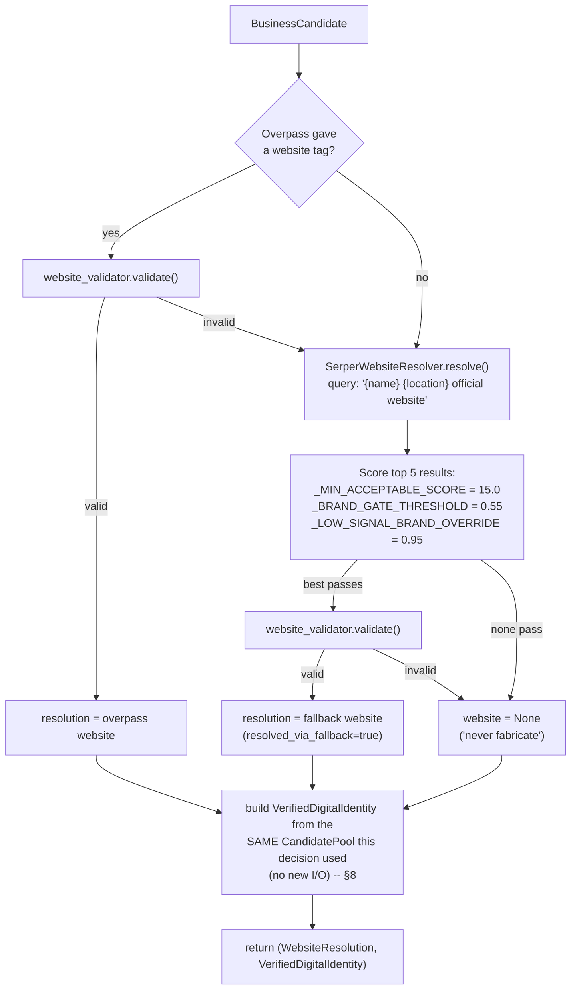

This diagram's decision logic (which candidate wins) is **byte-for-byte unchanged since before
Sprint 1** — `resolve_with_digital_identity()` is `resolve()`'s internal implementation plus one
extra return value, never a different decision path (see §8.1). The `VerifiedDigitalIdentity` this
step produces is what `ranking.py` (§6.7) and `discovery_eval` (§9) consume; `DiscoveredBusiness`
carries it as `business.identity`, `Optional[Any]` on the public DTO (kept untyped there
deliberately — see §7's DTO note) so nothing downstream that doesn't know about Sprint 4 breaks.

**`website_validator.py`** rules (verbatim constants):

- `REJECTED_DOMAINS` — ~37 domains (facebook, justdial, indiamart, tradeindia, zomato,
  swiggy, …) → immediate reject (a social/aggregator page is not the business's own site).
- `_ACCEPTED_STATUS_CODES = (200, 301, 302)`.
- Timeout `DISCOVERY_VALIDATOR_TIMEOUT_SECONDS` default **15s**; browser-like headers;
  `Accept-Encoding` deliberately excludes Brotli.
- Retry 2 attempts; 429/503 retryable.
- Checks content-type is `text/html` and the **post-redirect domain** isn't rejected.

**`grounding.py`** provides the brand-matching math used by both the Serper resolver and the
Sprint 1-4 identity pipeline: `_MIN_BRAND_WORD_LEN = 4`, `_MIN_PREFIX_WORD_LEN = 5`;
`brand_match_strength` tiers — exact = `1.0`, prefix/suffix = `0.75 + 0.15 × coverage`, substring
ratio ≥ 0.6 → `ratio × 0.85`; plus `is_low_signal_business_name` detection. As of Sprint 3,
`grounding.domain_root` is layered on top of `canonicalization.py` rather than parsing domains
itself (§8.3).

Legacy alternative: **`providers/brave_provider.py`** (`BraveWebsiteResolver`,
`BRAVE_API_KEY`) is still injectable but superseded by Serper as the default resolver.

### 6.6 Step 5 — Duplicate detection: `duplicate_detector.py`

In-batch only (DB-level dedup happens later at lead creation). Dedup key priority:
**registrable domain** first (e.g. `nike.com`), else **normalized name + phone**. Later
occurrences are flagged `duplicate`.

### 6.7 Step 6 — Deterministic ranking: `ranking.py`

Only businesses that are `validated and not duplicate` are eligible. As of Sprint 4, every
component below is **identity-aware with fallback**: it reads an already-computed signal off
`business.identity` (the `VerifiedDigitalIdentity` from §6.5) when present, and falls back to the
exact pre-Sprint-4 raw-field computation, byte-for-byte, when `business.identity is None` (e.g. a
hand-built `DiscoveredBusiness` in a test, or a caller still on plain `resolve()`).

| Signal | Points | Identity-aware source (Sprint 4) | Fallback source (pre-Sprint-4, unchanged) |
|---|---|---|---|
| Website verification | **40.0** | `identity.verification_quality.strength`, scaled `0.6–1.0×` of max | flat 40 pts if `resolution.validated and website` |
| Category match | **20.0** | *(no upstream equivalent — stays as-is; not a website-identity signal)* | name/category text overlap with query; 50% partial credit |
| Location match | **15.0** | `identity.feature_store`'s `FeatureId.LOCATION_CONSISTENCY` | address/domain text overlap with query; 50% partial credit |
| Domain/brand match | **15.0** | `FeatureId.BRAND_SIMILARITY` | `grounding.brand_match_strength(name, domain)` |
| Contact/record completeness | **15.0** | `identity.identity_completeness.overall_score` (8 weighted dimensions) | phone/address/website 3-field presence count |
| Rating | **10.0** | *(no upstream equivalent — stays as-is)* | `rating / 5.0 × 10` |
| Review count | **10.0** | *(no upstream equivalent — stays as-is)* | `log1p(count) × 2.0`, capped |
| **Identity stability** *(new in Sprint 4, no pre-Sprint-4 equivalent)* | **10.0** | `identity.quality.identity_stability` (competition margin + consensus + evidence diversity + conflict, from `identity_resolution_engine.py`) | `0.0` — purely additive when identity is unavailable |

Total budget is now **0–135 points** (was 0–125 before Sprint 4 — the +10 is entirely the new
identity-stability component). Result list is sorted by score desc, then sliced to the requested
`limit`.

### 6.8 Step 7 — Lead creation & pipeline fan-out (`discovery_service.py`)

For each selected business, `_create_leads_and_run_pipelines`:

1. `SubscriptionService.can_create_lead` quota check → outcome `quota_exceeded` if over.
2. `crud.get_lead_by_url(website, org_id)` → outcome `duplicate` if the Lead already exists.
3. `crud.create_lead(LeadCreate(website, organization_id, owner_id))`.
4. Pre-seeds `phone` / `address` from discovery data via `crud.update_lead`.
5. `db.commit()`, then `_run_pipelines` awaits `run_lead_pipeline(lead.id)` for every new
   lead under `asyncio.Semaphore(DISCOVERY_MAX_CONCURRENT_PIPELINES)` (env default `"3"`).

Outcome statuses per business (from `dto.py` → `LeadCreationOutcome`): `validated`,
`not_selected`, `no_website`, `duplicate`, `validation_failed`, `quota_exceeded`,
`pipeline_error`. `VerifiedDigitalIdentity` is **not** exposed on `LeadCreationOutcome` or
`DiscoveryResponse` today — see §20, gap 14.

### 6.9 Step 8 — Metrics & response

`_record_metrics` writes one `DiscoveryRunRecord` row (table `discovery_run_logs`) with:
query, category, location, requested_limit, businesses_returned,
businesses_missing_website, websites_resolved_via_fallback, duplicates_removed,
validated_leads, duration_ms. The client receives a `DiscoveryResponse` containing the
created leads plus every non-selected/rejected outcome with its reason.

---
## 7. Discovery Subsystem — `application/discovery/`

`application/discovery/` is the largest single package in the backend: 23 modules plus
`__init__.py`, plus 5 provider modules (+ `__init__.py`) under `providers/`. It grew in four
recognizable layers, oldest to newest:

1. **MVP pipeline** (query parsing → search providers → website resolution/validation →
   dedup → ranking) — walked step-by-step in §6.
2. **Digital Identity Pipeline, Sprints 1–4** (`evidence.py` through `digital_identity.py`) —
   an internal, additive scoring/verification layer that sits *underneath* the MVP pipeline
   without changing any of its public contracts. Deep dive in §8.
3. `discovery_service.py` — the orchestrator that ties both of the above together and is the
   only file this package exposes to `api/endpoints/discovery.py`.
4. `discovery_eval/` — a sibling top-level package (not inside `application/discovery/` at
   all) that offline-benchmarks layer 2 against real queries. Covered in §9.

### 7.1 File map

| File | Layer | Responsibility |
|---|---|---|
| `discovery_service.py` | Orchestration | `DiscoveryService.discover_and_create_leads()` — the only entry point this package exposes |
| `dto.py` | Shared foundation | `ParsedQuery`, `BusinessCandidate`, `WebsiteResolution`, `DiscoveredBusiness` (now carries `identity: Optional[Any]`), `DiscoveryResponse`, `LeadCreationOutcome` |
| `exceptions.py` | Shared foundation | `QueryParseError`, provider/resolution error types |
| `query_parser.py` / `locations.py` | MVP pipeline | Free-text → `ParsedQuery` (§6.3) |
| `providers/overpass_provider.py` | MVP pipeline | Primary business search (OpenStreetMap) |
| `providers/serper_provider.py` | MVP pipeline | Fallback business search + website resolution (Google Serper) |
| `providers/brave_provider.py` | MVP pipeline (legacy) | Alternative website resolver, still injectable, superseded by Serper |
| `providers/http_utils.py`, `providers/base.py` | MVP pipeline | Shared HTTP retry helpers + provider interfaces |
| `business_normalizer.py` | MVP pipeline | Normalizes raw Overpass tags into `BusinessCandidate` |
| `website_resolver.py` | MVP pipeline ⇄ Identity Pipeline | `resolve()` (unchanged decision logic) + `resolve_with_digital_identity()` (Sprint 4 bridge, §8.1) |
| `website_validator.py` | MVP pipeline | Rejects aggregator/social domains, validates reachability (§6.5) |
| `duplicate_detector.py` | MVP pipeline | In-batch dedup by domain, else name+phone |
| `ranking.py` | MVP pipeline ⇄ Identity Pipeline | Identity-aware scoring with byte-for-byte fallback (§6.7) |
| `grounding.py` | Shared by both | Brand/domain match scoring, layered on `canonicalization.py` since Sprint 3 |
| `evidence.py` | Identity Pipeline — Sprint 1 | Raw per-URL signal → structured `Evidence` |
| `features.py` | Identity Pipeline — Sprint 2B | `Evidence` → normalized `FeatureSet` (`FeatureId`) |
| `verification.py` | Identity Pipeline — Sprint 2B | 5 independent verifiers over a `FeatureSet` |
| `confidence.py` | Identity Pipeline — Sprint 2B | Staged, explainable confidence propagation |
| `identity.py` | Identity Pipeline — Sprint 2A | `BusinessIdentity` — name/website selection + `DecisionTrace` |
| `canonicalization.py` | Identity Pipeline — Sprint 3 | Domain structure normalization (registrable domain, punycode, ports) |
| `organization.py` | Identity Pipeline — Sprint 3 | Groups related identities into `OrganizationGroup` + `RelationshipType` |
| `competition.py` | Identity Pipeline — Sprint 3 | Relative confidence between competing candidates + conflict flags |
| `reliability.py` | Identity Pipeline — Sprint 3/4 | `ProviderReliabilityRegistry` — learned per-provider trust |
| `false_positive.py` | Identity Pipeline — Sprint 3 | Structural rejection signals + cross-tenant domain reuse detection |
| `identity_resolution_engine.py` | Identity Pipeline — Sprint 3/4 | Orchestrates canon/org/competition/reliability/false-positive into one `IdentityResolutionResult` |
| `digital_identity.py` | Identity Pipeline — Sprint 2C | `DigitalIdentityBuilder` — the final `VerifiedDigitalIdentity` (quality + risk + consensus + status) |

Full per-file line counts and test coverage: §16. Import-level dependency graph for every file
above: §8.2 (rendered as SVG, not Mermaid — see §19 for why).

### 7.2 The two pipelines' contract

The single rule that keeps 23 files from becoming an unmaintainable tangle: **the Digital
Identity Pipeline (layer 2) is read-only with respect to the MVP pipeline (layer 1).** It
consumes `BusinessCandidate`, `WebsiteResolution`, and the `CandidatePool` that
`WebsiteResolver.resolve()` already builds internally while deciding which website wins — it
never influences *that* decision, and nothing in layer 1 imports anything from layer 2 except
the two call sites documented in §6.5 (`website_resolver.py`) and §6.7 (`ranking.py`), both of
which fall back to their exact pre-Sprint-4 behavior when no identity is available. This is why
Sprint 4 could ship as "add digital identity to an already-shipped, already-working codebase"
rather than a rewrite: every existing test in `tests/application/discovery/` (pre-dating this
change) still passes unmodified against the post-Sprint-4 code, because nothing it already
covered changed.

---
## 8. Digital Identity Pipeline — Sprints 1-4 Deep Dive

Everything in this section lives inside `application/discovery/` alongside the MVP pipeline
(§7), but forms its own internal call graph. It answers one question per business candidate:
**"how much should we trust that this website belongs to this business, and why?"** — and it
answers that question the same way regardless of business category (restaurants, shoe stores,
dentists, …), because every input into it is itself category-agnostic (see `digital_identity.py`'s
own module docstring, quoted at multiple points below).

### 8.1 The bridge: `resolve_with_digital_identity()`

`website_resolver.py` has carried two public methods since Sprint 2C:

- `resolve(candidate, location) -> WebsiteResolution` — the original method, decision logic
  untouched since before Sprint 1.
- `resolve_with_digital_identity(candidate, location) -> (WebsiteResolution, VerifiedDigitalIdentity)`
  — same internal resolution, plus the identity object built from the same `CandidatePool` the
  resolution already populated. **No extra network I/O.**

Sprint 4's only change to `discovery_service.py` was switching `_resolve_and_validate`'s one call
site from the first method to the second (§6.5). This is why the identity pipeline could be added
without touching a single assertion in the pre-existing test suite: the object that changed
(`DiscoveredBusiness.identity`) is new, additive, and `Optional[Any]` on the DTO — nothing that
already read `DiscoveredBusiness` had to change to keep compiling or keep passing.

### 8.2 Module dependency graph

<a href="diagrams/discovery_module_dependency_graph.svg">
  
</a>

*Click the image to open the full-resolution SVG in a new tab (infinitely zoomable — it's a
vector file, not a raster screenshot). Rendered from
`docs/diagrams/discovery_module_dependency_graph.dot` via Graphviz — regeneration command in
§19. Blue = pre-existing MVP modules, orange = new Sprint 1-4 modules, dark = the package's one
orchestration entry point.*

### 8.3 Pipeline data flow

<a href="diagrams/digital_identity_pipeline_flow.svg">
  
</a>

*Click to open full-resolution. Rendered from `docs/diagrams/digital_identity_pipeline_flow.dot`.
This is the diagram the note in §6.1 refers to — the detail inside the sequence diagram's single
`DI` participant.*

#### Stage 1 — `evidence.py` (Sprint 1): raw signal → `Evidence`

Turns each `CandidatePool` URL into an `EvidenceBundle`. `EvidenceType` has 8 members actually
populated in Sprint 1 (`PROVIDER_FOUND`, `PROVIDER_AGREEMENT`, `PROVIDER_DISAGREEMENT`,
`BRAND_MATCH`, `LOCATION_MATCH`, `REACHABILITY`, `HTTPS`, `CANONICAL_URL`) plus 7 more that are
deliberately defined but never constructed yet (`PHONE_MATCH`, `ADDRESS_MATCH`,
`SCHEMA_PRESENCE`, `ORGANIZATION_SCHEMA`, `OPENGRAPH`, `ORGANIZATION_METADATA`,
`CONTACT_PAGE`) — reserved for a future verification engine that would need the actual page HTML
LeadPipeline's real scrape downloads later, which nothing in Discovery has at search time.
`EvidenceCategory` (`PROVIDER`, `IDENTITY`, `LOCATION`, `VERIFICATION`, `BUSINESS`) is the coarse
grouping used to filter/summarize a bundle.

#### Stage 2 — `features.py` (Sprint 2B): `Evidence` → `FeatureSet`

Normalizes an `EvidenceBundle` into a `FeatureSet` keyed by `FeatureId` — always fully populated
(no membership checks needed downstream): `BRAND_SIMILARITY`, `CANONICAL_DOMAIN`,
`REACHABILITY`, `HTTPS`, `DOMAIN_QUALITY` (composite of the previous 3),
`PROVIDER_AGREEMENT`, `LOCATION_CONSISTENCY`, `BUSINESS_COMPLETENESS`, `CONTACT_COMPLETENESS`,
`VERIFICATION_READINESS`, `EVIDENCE_DENSITY`, and `WEBSITE_STRUCTURE` (reserved — no page is ever
scraped at this stage, so this one always reports "not available in this pipeline" rather than a
fabricated value).

#### Stage 3 — `verification.py` (Sprint 2B): `FeatureSet` → `VerificationBundle`

Five independent verifiers (domain / business / location / website / identity) each produce a
`VerificationResult` with one of three statuses — `PASSED`, `FAILED`, or **`INCONCLUSIVE`**
(deliberately distinct from `FAILED`: "not enough underlying feature data to decide either way,"
never silently reported as a pass or fail when the honest answer is "unknown").

#### Stage 4 — `confidence.py` (Sprint 2B): staged, explainable propagation

Confidence flows **provider → website → business → identity → final**, each stage's output
traceable back to the `FeatureSet`/`VerificationBundle` that produced it (used for
`BusinessIdentity.decision_trace` and `VerificationTrace.explain()` in §8.4 below).

#### Stage 5 — `identity.py` (Sprint 2A): `BusinessIdentity`

`GenericIdentityResolver.resolve()` groups website candidates by domain
(`WebsiteCandidateGroup`), then selects a winner and produces a `BusinessIdentity` (normalized
name, selected website, `DecisionTrace`, `FeatureStore`). Its primary confidence figure
(`BusinessIdentity.confidence`) comes from Stage 4's `ConfidencePropagationEngine`, computed over
Stage 2's `FeatureSet`/`FeatureId` — **not** from this module's own, earlier `FeatureName`-based
`extract_features()`, which Sprint 2A predates Sprint 2B by. That earlier path still runs per
group, but only feeds a secondary `identity_verification` cross-check
(`verify_identity_features`), not the confidence figure everything downstream reads. This is the
one place in the pipeline where an older and newer scoring mechanism knowingly coexist — flagged
here, and in the module's own docstring, rather than silently left ambiguous.

#### Stage 6 — Sprint 3 supporting modules

| Module | Produces | Purpose |
|---|---|---|
| `canonicalization.py` | Registrable domain, subdomain, punycode form, default-port normalization | Gives every other Sprint 3 module one consistent notion of "same domain" |
| `organization.py` | `IdentityCandidate` → `OrganizationGroup` + `OrganizationRelationship` (via `consolidate()` / `resolve_relationships()`) | Groups related identities (e.g. a redirect, a regional mirror) instead of treating them as unrelated competitors |
| `competition.py` | `CompetitionResult` (`compete()`) + `ConflictAssessment` (`assess_conflicts()`) | Relative confidence between candidates that *are* competing, plus explicit conflict flags |
| `reliability.py` | `ProviderReliabilityRegistry` | Learns, from observed provider agreement over time, how much to trust each search provider — feeds `IdentityResolutionResult.provider_reliability` and (Sprint 4) `provider_operational_metrics` |
| `false_positive.py` | Structural rejection signals | Cross-tenant domain reuse detection and other structural "this is probably not a match" signals |

`organization.py`'s `RelationshipType` enum has 8 members named in the Sprint 3 brief
(`OFFICIAL`, `ALIAS`, `MIRROR`, `REDIRECT`, `REGIONAL`, `BRANCH`, `CORPORATE`, `PRODUCT`,
`MARKETPLACE`) — same "reserved, not fabricated" pattern as `EvidenceType`: only `REDIRECT`,
`REGIONAL`, and `UNKNOWN` are ever actually constructed by `resolve_relationships()` today,
because those are the only ones this pipeline currently has real signal for.

#### Stage 7 — `identity_resolution_engine.py` (Sprint 3/4): `IdentityResolutionResult`

`IdentityResolutionEngine.resolve()` is the single call site that invokes every Stage 6 module
and rolls the results into one `IdentityResolutionResult`: `identity_candidates`,
`organization_groups`, `organization_relationships`, `competition`, `conflict_assessment`,
`provider_reliability`, `selection_confidence`, `selection_reason`, `alternative_candidates`,
`rejected_candidate_reasons`, `identity_stability`, `evidence_diversity`, and (Sprint 4)
`provider_operational_metrics`.

#### Stage 8 — `digital_identity.py` (Sprint 2C): `VerifiedDigitalIdentity`

`DigitalIdentityBuilder` combines a `BusinessIdentity` (Stage 5) with an
`IdentityResolutionResult` (Stage 7) into the final `VerifiedDigitalIdentity`:

- **`DigitalIdentityQuality`** — `identity_completeness`, `verification_strength`,
  `evidence_density`, `provider_consensus`, `verification_coverage`, `risk_level`,
  `missing_signals`, and Sprint-3-added `identity_stability` /
  `evidence_diversity` (sourced straight from `IdentityResolutionResult`, never recomputed),
  rolled into one `overall_score`.
- **`RiskAssessment`** — a tuple of `RiskIndicator`s plus a rolled-up `risk_level` (`"none"` /
  `"low"` / `"medium"` / `"high"`). Purely diagnostic: never fabricated, never blocking — an
  empty `indicators` tuple is itself a meaningful "clean bill," not an omission.
- **`VerificationTrace`** — every candidate's own `VerificationBundle` (not just the winner's),
  so a caller can answer "why did every *other* candidate fail too," not only why the selected
  one passed.
- **`DigitalIdentityStatus`** — the top-line, human-facing verdict, deliberately coarser than
  the numeric scores it derives from:

  | Status | Meaning | Derivation |
  |---|---|---|
  | `NO_IDENTITY` | No candidate website was ever proposed | `verification_state == "no_candidates"` |
  | `UNVERIFIED` | A candidate existed but never passed verification | `verification_state != "verified"` |
  | `VERIFIED_WEAK` | Verified, but low quality and/or elevated risk | verified, below moderate threshold |
  | `VERIFIED_MODERATE` | Verified, moderate quality | `overall_score >= 0.4` |
  | `VERIFIED_STRONG` | Verified, high quality, no more than low risk | `overall_score >= 0.7` and `risk_level` in `("none", "low")` |

### 8.4 What ranking.py and discovery_eval actually read

Nothing downstream reaches into every field above — §6.7's ranking table shows exactly which
four fields `ranking.py` reads (`verification_quality.strength`, two `FeatureId` entries off
`feature_store`, `identity_completeness.overall_score`, and `quality.identity_stability`), and
§9 covers what `discovery_eval` aggregates across a benchmark run. Everything else
(`VerificationTrace`, `RiskAssessment.indicators`, `alternative_candidates`,
`rejected_candidate_reasons`, …) exists today for logging/debugging and for a future API surface
— see §20, gap 14, for the one concrete gap this leaves (none of it reaches
`DiscoveryResponse` yet).

---
## 9. Discovery Evaluation Harness — `discovery_eval/`

`discovery_eval/` is a **sibling** top-level package to `application/` — not nested inside
`application/discovery/` — because it is a standalone, importable offline tool, not part of the
running API/worker. It benchmarks the pipeline described in §6–§8 against a fixed, permanent
regression query set and produces a report a human reviews; it is never invoked by
`discovery_service.py`, `api/endpoints/discovery.py`, or any request path.

```
discovery_eval/
├── README.md         -- usage, flags, what "good" looks like
├── queries.py        -- ~100 fixed benchmark queries (id, query, domain, difficulty)
├── run_eval.py        -- the runner: `python -m discovery_eval.run_eval`
├── metrics.py         -- QueryRecord / BusinessRecord extraction + aggregate_metrics()
├── report.py          -- CSV / JSON / Markdown report writers
├── charts.py           -- 4 matplotlib PNGs: latency, confidence, validation_success, provider_performance
└── tests/
    └── test_discovery_eval.py   -- pure-logic unit tests for the 5 modules above (§18)
```

### 9.1 What it actually runs

`run_eval.py` drives `DiscoveryService` as a black box, but **only through its existing internal
stage methods** — `_search`, `_resolve_and_validate`, `_detect_duplicates`, plus the public
`rank_businesses()` — the exact same sequence `discover_and_create_leads()` itself runs before it
would ever create a Lead. It is constructed with `db=None` and never calls
`discover_and_create_leads()` itself, so a full benchmark run (all ~100 queries):

- creates **no** Lead rows and spends **no** subscription/lead quota,
- triggers **no** AI enrichment, scraper, or `LeadPipeline` run,
- still makes **real, live calls** to the production search providers (Overpass, Serper, and
  Brave if configured) — it needs the same API keys Discovery itself needs (`SERPER_API_KEY`,
  etc.); a missing key degrades gracefully into a low validation/resolution rate in the report
  rather than a crash.

That last point is exactly why it is **not** part of the CI `pytest` job (§6.9's CI note, §18):
CI has no `SERPER_API_KEY` and shouldn't be making live external calls on every PR. What CI *does*
run is `discovery_eval/tests/`, the harness's own unit tests — pure-logic coverage of
`metrics.py`/`report.py`/`charts.py` using synthetic, no-op stub records, needing no network, no
DB, and no provider keys.

### 9.2 The 100-query benchmark set — `queries.py`

Every query is plain text designed to parse under the real `QueryParser` (§6.3) — the same
patterns a user's search box would receive. `domain` and `difficulty` are metadata for this
harness's own reporting only; they are **never** passed into Discovery. A query that fails to
parse isn't a bug in the dataset — `QueryParser` correctly rejecting a malformed query is itself a
recorded, valid outcome (`QueryRecord.error`). Difficulty tags include `standard`,
`ambiguous_name` (a short/common business name with no strong brand signal, e.g. "Regal"), and
`alias_city` (a colloquial/former city name — Bombay, Madras, Bangalore, Gurgaon — exercising
`locations.py`'s `LOCATION_ALIASES`, §6.3).

### 9.3 Metrics — `metrics.py`

Two record shapes, one per query and one per business the query considered (selected,
not-selected, or rejected):

- **`QueryRecord`** — parse result, per-stage timings (search/resolve/dedup/ranking), provider
  count, and outcome counts (validated/rejected/duplicate/no-website).
- **`BusinessRecord`** — everything §8 computed for that business: `winner_confidence`,
  `identity_stability`, `competition_margin`, `competition_rival_count`,
  `provider_agreement`, `verification_strength`, and more — **read**, never recomputed;
  the module docstring is explicit that this file's job is extraction, not scoring.

Every audit threshold is a fixed, documented, **never-learned-on-this-run's-own-data** constant —
the same discipline Discovery's own scoring weights follow (§6.7): `WEAK_CONFIDENCE_THRESHOLD =
0.5`, `LOW_STABILITY_THRESHOLD = 0.4`, `THIN_MARGIN_THRESHOLD = 0.05`,
`WEAK_PROVIDER_AGREEMENT_THRESHOLD = 0.5`, `CLOSE_RANK_SCORE_DELTA = 5.0` (against `ranking.py`'s
0–135 point budget, §6.7). `aggregate_metrics()` rolls every `QueryRecord`/`BusinessRecord` from a
run into the run-level numbers `report.py` and `charts.py` both read.

### 9.4 Reports & charts

- **`report.py`** — writes `queries.csv`, `businesses.csv`, a JSON export, and a Markdown summary.
  Every number in the Markdown report is read straight from `aggregate_metrics()`'s output;
  recommendations are built exclusively from thresholds the run actually crossed, never invented.
- **`charts.py`** — exactly 4 PNGs via `matplotlib` (`Agg` backend, headless-safe):
  `latency.png`, `confidence.png`, `validation_success.png`, `provider_performance.png`. This is
  the one place `matplotlib` is a real dependency of this repository — see the note added to
  `requirements.txt`.

### 9.5 Running it yourself

```bash
cd backend
python -m discovery_eval.run_eval                 # full ~100-query benchmark
python -m discovery_eval.run_eval --limit 10        # quick smoke run
python -m discovery_eval.run_eval --concurrency 5   # override query concurrency
```

Must be run from `backend/` (the directory containing `application/`) so
`application.discovery.*` imports resolve, and needs the same environment/API keys the production
Discovery pipeline needs. See `discovery_eval/README.md` for the full flag list and for what a
healthy run's numbers look like.

---
## 10. AI Lead Pipeline — `application/workflows/` + agents

### 8.1 `workflows/lead_pipeline.py` — the LangGraph graph

**Responsibility:** Builds and executes the 10-node LangGraph `StateGraph(LeadState)`;
owns pipeline status semantics and execution-record persistence.

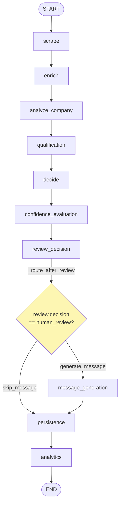

The **only conditional edge** in the whole graph is `_route_after_review`:
`review.decision == "human_review"` → `"skip_message"` (straight to persistence),
otherwise `"generate_message"`.

`execute(lead_id)` flow:

1. Generate a UUID `pipeline_id`.
2. Load the Lead — **not found → `FAILED` immediately** (no `PipelineExecutionRecord` is
   written because there is no FK target).
3. `check_ai_features_enabled(db, organization_id)` → stored in state as
   `ai_features_enabled` (plan gating, see §13.2).
4. `graph.ainvoke(initial_state)` wrapped in a safety-net `try/except` — a graph runtime
   exception is the only other path to `FAILED`.
5. **Status rule:** `SUCCESS` iff the `errors` list is empty, else `PARTIAL_SUCCESS`.
   `FAILED` is reserved for lead-not-found or a graph-level exception.
6. `_record_execution` writes a `PipelineExecutionRecord` best-effort (never raises).

`run_lead_pipeline(lead_id)` is the public entry: opens its **own `SessionLocal()`**,
rolls back + returns a `FAILED` dict on exception, closes the session in `finally`. It is
invoked from `api/endpoints/leads.py` via `background_tasks.add_task` (single + batch
creation) and awaited directly by `POST /leads/{id}/process`. `DiscoveryService` fans out
to it as well (§6).

### 8.2 `workflows/graph_nodes.py` — the 10 node implementations

**Responsibility:** One async function per graph node; all wrapped by `_run_stage`.

`_run_stage` (the graceful-degradation core): wraps every node in `stage_span`
(structured start/complete/failed logs), records the duration in
`state["stage_timings_ms"]`, **catches ALL exceptions** and appends `{stage, error}` to
`state["errors"]` instead of raising — this is why a broken node yields
`PARTIAL_SUCCESS`, never a crashed pipeline.

| Node | What it does | Files it calls |
|---|---|---|
| `scrape` | `infra_adapters.scrape_lead` (TieredScraper), writes a `ScrapingLog`, updates Lead scrape fields | `services/infra_adapters.py`, `scraping/scraper.py`, `crud.py` |
| `enrich` | **Skipped when AI features disabled**; `asyncio.to_thread(enrich_lead)` (WaterfallEnricher), writes `LeadEnrichmentLog` | `infra_adapters.py`, `enrichment/enricher.py` |
| `analyze_company` | `ContextBuilder.build` → `CompanyIntelligenceAgent.run` (in a thread) → `memory.store` → `PromptExecutionRecord` if source was LLM | `context/context_builder.py`, `agents/company_intelligence_agent.py`, `memory/db_memory.py`, `observability/repository.py` |
| `qualification` | `score_lead` with the optional `CompanyIntelligenceOutput` | `infra_adapters.py`, `core/domain/services/scoring.py` |
| `decide` | Builds `DecisionContext` → `DecisionAgent.run` | `agents/decision_agent.py` |
| `confidence_evaluation` | Fully deterministic `build_evaluation_report`; expected fields `qualification`, `recommended_action`; source text = about_text + scraped `text_content` + industry analysis; writes `EvaluationReportRecord` | `evaluation/evaluators.py`, `observability/repository.py` |
| `review_decision` | `ReviewAgent.run` (threshold gating, zero LLM) | `agents/review_agent.py` |
| `message_generation` | If AI disabled → `_FREE_TIER_MESSAGE = "No outreach message generated - AI features not available on your plan"`; if human_review → skipped by routing; else `MessagingAgent.run` + `update_lead(outreach_message=email_body)` | `agents/messaging_agent.py`, `crud.py` |
| `persistence` | `db.commit()` only — makes all accumulated ORM changes durable | `database/` |
| `analytics` | Emits one structured log line `event=pipeline_analytics` with timings + status | `logging/` |

### 8.3 The four agents — `application/agents/`

All agents share the same pattern (`base.py` provides the common `BaseAgent` machinery):

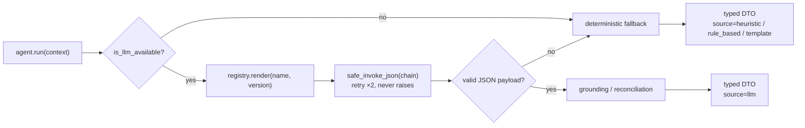

| Agent | Prompt / temp / max_tokens | LLM path | Deterministic fallback |
|---|---|---|---|
| `company_intelligence_agent.py` | `company_intelligence` v1, temp **0.1**, max **700**; about_text truncated to **1000** chars | Extracts industry, size signals, tech, pain points, growth indicators. `_grounded_technology_signals` **drops any LLM-claimed technology not found case-insensitively in the evidence text** (logged) | Heuristic: website_quality — ≥5 signals "comprehensive", ≥3 "developed", ≥1 "minimal", else "unknown"; `icp_alignment_score` = fraction of 7 boolean signals; pain_points/growth_indicators empty |
| `decision_agent.py` | `decision` v1, temp **0.1**, max **500** | LLM proposes qualification + action; `_reconcile_action` accepts the LLM action **only if equal or more conservative** than the rule-based one (ordering `proceed 0 < review 1 < reject 2`) | `_ACTION_BY_LABEL = {"Hot Lead": "proceed", "Warm Lead": "proceed", "Cold Lead": "review", "Disqualified": "reject"}`, unknown label → `review`; source `"rule_based"` |
| `messaging_agent.py` | `messaging` v1, temp **0.3**, max **500**; about_text truncated to **600** chars | **Single call** produces email subject + body, LinkedIn opener, follow-up angle | `infra_adapters.generate_template_message` (Messenger templates), source `"template"` |
| `review_agent.py` | — (zero LLM by design) | n/a | Pure thresholds: `REVIEW_AUTO_APPROVE_THRESHOLD` (default `"0.75"`), `REVIEW_HUMAN_REVIEW_THRESHOLD` (default `"0.45"`) |

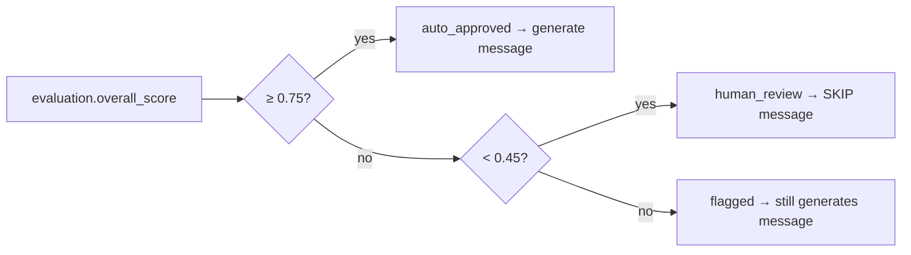

### 8.4 Prompt system — `application/prompts/`

| File | Responsibility |
|---|---|
| `registry.py` | Loads every `templates/*.yaml` at first use, keyed by `(name, version)`; `"latest"` = lexicographically highest version; `render()` validates that all declared variables were supplied (raises `PromptError`); process-wide singleton via `get_prompt_registry()` |
| `schemas.py` | Pydantic schemas describing the expected JSON output shape of each prompt |
| `templates/company_intelligence_v1.yaml` | 6 variables (incl. `evidence_summary`); JSON-only output contract |
| `templates/decision_v1.yaml` | 8 variables; enumerated `qualification` / `action` values |
| `templates/messaging_v1.yaml` | 7 variables; email + LinkedIn + follow-up in one JSON |

### 8.5 `services/llm_provider.py` — the LLM boundary

- `is_llm_available()` — true iff `GROQ_API_KEY` is set **and** ≠ `"local_test_mode"`.
- `LLM_MODEL` default **`llama-3.3-70b-versatile`** (ChatGroq).
- `get_llm()` returns `None` instead of raising when unavailable.
- `_invoke_chain_with_retry` — fresh tenacity `Retrying` per call:
  `stop_after_attempt(2)`, `wait_random_exponential(multiplier=1.0, max=4.0)`.
- `safe_invoke_json` — invokes, extracts JSON with regex `\{.*\}` (DOTALL), returns
  `(payload_or_None, retry_count)`; **never raises** — the calling agent falls back.

---

## 11. Application Support Modules

### 9.1 `context/context_builder.py`

Builds the `LeadContext` an agent sees: the Lead row + its Organization + **memory**
(previous company analysis, last 5 decisions, last 5 outreach messages from
`ai_decision_logs`) + `crm_history` (an empty extension point). `sender_org` =
organization name, else env `SENDER_ORG`, default `"Our Company"`.
`analysis_text(max_chars=4000)` renders the flattened prompt-ready text.

### 9.2 `state/lead_state.py`

`LeadState` — a `TypedDict(total=False)` carried through the graph: `pipeline_id`,
`lead_id`, `organization_id`, `ai_features_enabled`, `lead_snapshot`, `scraping_result`,
`scraped_data`, `enrichment_result`, `enriched_data`, `context`, `company_intelligence`,
`score_result`, `decision`, `evaluation`, `review`, `message`, `stage_timings_ms`,
`errors`, `status`. Also `DecisionContext` (defaults: score `0.0`, label `"Low Priority"`).

### 9.3 `dto/models.py`

Typed boundaries between stages: `PipelineStatus` (SUCCESS / PARTIAL_SUCCESS / FAILED),
`Explanation` (reasoning / evidence / confidence 0–1), `CompanyIntelligenceOutput`,
`DecisionOutput` (defaults `"Unqualified"` / `"review"`), `EvaluationReport` (5 scores +
notes), `ReviewOutput` (default `"human_review"`), `MessagingOutput`, `PipelineResult`,
plus 3 metrics-summary DTOs. All LLM-produced DTOs carry `prompt_name`, `prompt_version`,
`retry_count` for auditability.

### 9.4 `evaluation/evaluators.py` — deterministic confidence scoring

- **completeness** = populated expected fields / expected fields.
- **grounding** — a claim is grounded if ≥ 50% of its > 3-char words appear in the source
  text; no evidence → `0.5`; no source text → `0.0`.
- **consistency** — `1.0` / `0.4` / `0.5` depending on decision-vs-score agreement.
- **overall = 0.4·confidence + 0.2·completeness + 0.2·grounding + 0.2·consistency**.
- Notes appended when completeness < 0.5, grounding < 0.4, or consistency < 0.5.

### 9.5 Remaining support files

| File | Responsibility |
|---|---|
| `explainability/explainer.py` | `deterministic_explanation` (fixed confidence **0.85**) and `explanation_from_llm_payload` (default confidence 0.5) — builds the `Explanation` DTO attached to every agent output |
| `memory/interfaces.py` | `BusinessMemory` ABC: `get_previous_company_analysis`, `get_previous_decisions(5)`, `get_previous_outreach(5)`, `store` |
| `memory/db_memory.py` | `SQLBusinessMemory` — implements the ABC over the `ai_decision_logs` table; `store` never raises (best-effort audit trail) |
| `interfaces/ports.py` | 6 `runtime_checkable` Protocols: Scraper / Enricher / Scorer / Messenger / LLMClient / BusinessMemory ports — the contract the application layer expects from infrastructure |
| `services/infra_adapters.py` | **The single bridge application → core**: `scrape_lead` (TieredScraper async ctx), `enrich_lead` (WaterfallEnricher), `score_lead` (LeadScoringService, forwards `CompanyIntelligenceOutput`), `generate_template_message` (Messenger; prefers `lead.organization` name), `check_ai_features_enabled` (SubscriptionService), plus DB query helpers |
| `exceptions/errors.py` | `ApplicationError` base → `AgentExecutionError(agent_name)`, `PromptError`, `LLMUnavailableError`, `WorkflowStageError(stage)`, `ContextBuildError` |
| `utils/retry.py` | `with_retry` decorator — defaults: 2 attempts, exponential wait min 1.0 / max 6.0 |
| `utils/stage_logger.py` | `StageTimer` + `stage_span` context manager emitting `stage_start` / `stage_complete` / `stage_failed` structured events; re-raises (catching is `_run_stage`'s job) |
| `dependencies.py` | `get_lead_pipeline(db)` DI provider — **gap: currently unused by any endpoint** (endpoints call `run_lead_pipeline` directly) |

---

## 12. Core Domain — `core/domain/`

### 10.1 Models — `core/domain/models/` (SQLAlchemy)

| File / Model | Table | Key columns & defaults |
|---|---|---|
| `user.py` — `User` | `users` | `email` unique, `hashed_password`, `is_active=True`, nullable FK `organization_id` |
| `organization.py` — `Organization` | `organizations` | `plan_tier="free"`, `max_users=1`, `max_leads=100`, `usage_count=0`, Stripe customer/subscription ids, `subscription` relationship (`uselist=False`) |
| `lead.py` — `Lead` | `leads` | `website` required; `score=0.0`; `qualification_label="Low Priority"`; 3 confidence columns `=0.0` (scrape/enrichment/overall); 3 source columns `="none"`; outreach fields; `is_active` soft delete. **No `LeadStatus` enum exists** |
| `lead.py` — `LeadEnrichmentLog`, `ScrapingLog` | per-stage logs | raw results + confidence + method per attempt |
| `lead.py` — `AIDecisionLog` | `ai_decision_logs` | indexed `stage` ∈ {company_intelligence, decision, review, messaging, evaluation}; **one additive table serving three consumers**: explainability audit, `SQLBusinessMemory`, evaluation history |
| `subscription.py` — `Plan` | `plans` | `name` unique (free/pro/enterprise), `max_leads_per_day`, `can_export=False`, `can_use_ai=False` |
| `subscription.py` — `Subscription` | `subscriptions` | `stripe_subscription_id` unique, `plan_name`, `status="active"` (canceled / past_due / unpaid), `cancel_at_period_end` |
| `billing.py` — `UsageRecord`, `Invoice` | usage + invoices | metering & invoice mirrors |
| `api_key.py` — `APIKey` | `api_keys` | `generate_key()` = `"lb_" + token_urlsafe(32)`; stores hash + **8-char prefix**; `rate_limit=100` rpm |

### 10.2 Schemas — `core/domain/schemas/` (Pydantic)

Request/response contracts per resource (`user.py`, `lead.py`, `organization.py`,
`subscription.py`, `api_key.py`). Notable:

- `LeadUpdate` **explicitly** includes `score`, `qualification_label`, scrape/enrichment
  confidence + source, `revenue_band`, `founded_year` — these were previously dropped
  silently by Pydantic v2 `extra="ignore"` (documented fix).
- **Gap:** `subscription.py` schema uses `plan_id` / `is_active`, which mismatches the
  ORM (`plan_name` / `status`).

### 10.3 `services/scoring.py` — `LeadScoringService`

Deterministic weighted scoring; weights must sum to 1.0 (±0.01) or init raises.

| Criterion | Weight | Threshold | Max pts | Rule |
|---|---|---|---|---|
| industry_match | 0.25 | 0.5 | 25 | `max × icp_alignment_score` from CompanyIntelligence; **0 if no intelligence** |
| company_size | 0.20 | 0.5 | 20 | preferred bands `["11-50", "51-200", "201-500"]`; 1 band away → 0.5×; ≥2 away or unknown → 0 |
| email_quality | 0.15 | 0.6 | 15 | confidence-scaled when ≥ 0.6; phone-only → 0.5 × max |
| scrape_quality | 0.15 | 0.6 | 15 | from scrape_confidence |
| enrichment_quality | 0.15 | 0.6 | 15 | from enrichment_confidence |
| linkedin_presence | 0.10 | 0.5 | 10 | LinkedIn URL present |

Classification: **≥ 80 Hot Lead, ≥ 60 Warm Lead, ≥ 40 Cold Lead, else Disqualified**;
total capped at 100. `ScoringModelType` enum has unused variants; per-organization
scoring-config methods are stubs.

---

## 13. Core Infrastructure — `core/infrastructure/`

### 11.1 `auth/security.py`

- Password hashing: **bcrypt** via passlib (72-byte limit) with a `pbkdf2_hmac`-SHA256
  100 000-iteration fallback (format `"pbkdf2_$salt$hash"`).
- JWT: `SECRET_KEY` env (insecure default caught by config validation), HS256,
  **access 30 min**, **refresh 7 days**; tokens carry `exp` + `type`.
- `get_current_user`: HTTPBearer → `verify_token` (type must be `access`, `sub` present)
  → `crud.get_user` → 401 on any failure. `get_current_active_user` additionally requires
  `is_active`.
- **Gap:** `verify_api_key` looks up by 8-char prefix only — full-hash verification is
  explicitly left as a stub.

### 11.2 `billing/subscription_service.py` — plan gating

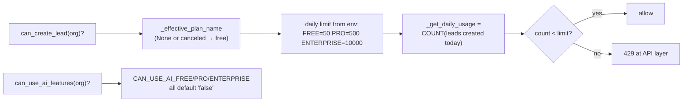

- Env limits: `FREE_MAX_LEADS_PER_DAY=50`, `PRO…=500`, `ENTERPRISE…=10000`;
  `CAN_USE_AI_*` and `CAN_EXPORT_*` all default `"false"`.
- `initialize_plans` seeds the 3 Plan rows at startup (idempotent).
- `assign_plan` creates a synthetic Stripe id `sub_{org}_{plan}_{ts}` (no real payment).
- `cancel`: immediate → status `canceled`, else `cancel_at_period_end=True`.
- **No prices are defined anywhere in the codebase.**

### 11.3 `billing/stripe_service.py`

Real Stripe SDK calls exist (Customer/Subscription CRUD, billing portal,
`Webhook.construct_event` for 5 event types) but: payment succeeded/failed handlers are
`pass`, metered usage is commented out, the plan map is a placeholder
(`price_123→starter, price_456→pro, price_789→enterprise`), and **no webhook route is
registered in `main.py`**. Exposed as global singleton `stripe_service`. The billing
upgrade endpoint returns **402 "Online payments coming soon."**

### 11.4 `database/` — engine + CRUD

- `__init__.py`: `DATABASE_URL` **required** (raises if missing); production forces
  PostgreSQL. Pool: `pre_ping`, size **20**, overflow **40**, recycle **3600 s**, timeout
  **30 s**; `connect_timeout=10s`, `statement_timeout=30000ms`. `SessionLocal` with
  `expire_on_commit=False`. `init_db` = `Base.metadata.create_all` — **no Alembic
  migrations**. `get_db` yields a per-request session with rollback-on-error.
- `crud.py`: the only place raw queries live — User/Organization/Lead/APIKey/
  Subscription/Usage CRUD, `create_ai_decision_log`, `get_lead_by_url` (discovery dedup),
  scraping/enrichment log writers.

### 11.5 `enrichment/enricher.py` — `WaterfallEnricher`

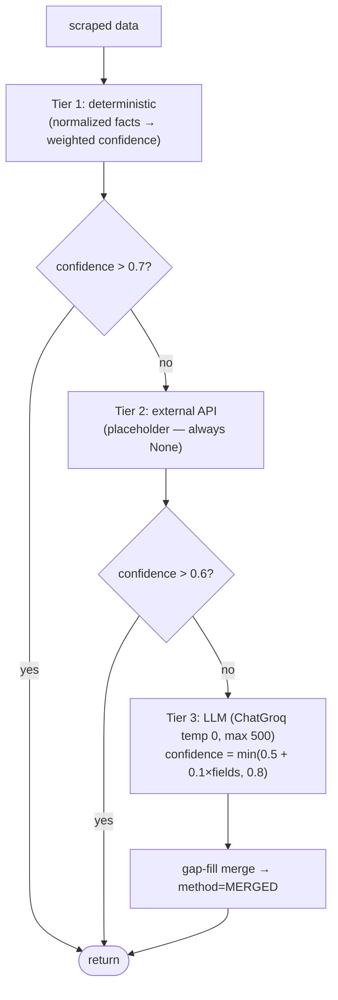

Tier-1 fact weights: organization_type 0.30, founded_year 0.15, employee_count 0.15,
operating_regions 0.10, offerings 0.10, primary_contact 0.15, contact_name 0.10,
contact_title 0.05; aggregate = weighted × (0.7 + 0.3 × min(1, parts/6)), capped **0.9**.
Employee bands `1-10 / 11-50 / 51-200 / 201-500 / 500+`; revenue `$0-1M … $100M+`.
Contact-email priority: general > contact > sales > support > press > careers > privacy >
billing.

### 11.6 `scraping/scraper.py` — `TieredScraper` (2664 lines)

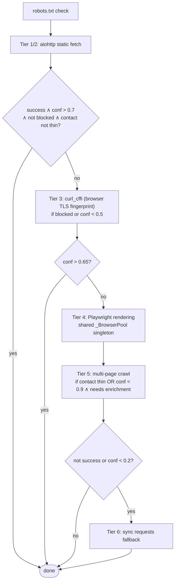

`TieredScraper(timeout=25, max_retries=2)`; honors `Retry-After` ≤ 10 s; backoff
`min(1.5 × 2^attempt, 8)` + jitter; rotates 6 User-Agents;
`_MAX_LOCATIONS_PER_BLOCK = 25`; `ScrapingMethod` enum records which tier won;
`close_scraper_resources()` (called at shutdown) closes the Playwright pool + the
singleton aiohttp session. Parsed output feeds `normalization/normalizer.py`.

### 11.7 Remaining infrastructure files

| File | Responsibility |
|---|---|
| `normalization/normalizer.py` | `normalize_scraped_fields(raw)` — brand/legal name split, organization_type classification (generic 0.4 vs specific 0.9 confidence), email de-obfuscation, E.164 phone formatting, block-grouped addresses, social-link filtering, technology extraction, `text_excerpt` capped 5000 chars. **Additive only** — never removes scraped data |
| `messaging/messenger.py` | Outreach **generation only — nothing is ever sent**. Needs ≥ 2 of 5 data points (company_name, industry, about > 50 chars, contact_name, employees) to use the LLM (temp 0.3, max_tokens 200, data-locked prompt); otherwise template fallback (industry-specific: software/consulting/ecommerce; generic; website-only). `MessageStyle`: professional / friendly / short |
| `logging/__init__.py` | python-json-logger to stdout, `LOG_LEVEL` default INFO; helpers `get_logger`, `log_api_call`, `log_scraping_attempt`, `log_enrichment_attempt`. Request-id correlation lives in `main.py` middleware |
| `workers/orchestrator.py` | Celery app `"leadboost_orchestrator"` (broker/backend default `redis://localhost:6379/0`), task `process_lead_task` (max_retries 3, delay 60 s) — **dormant: zero imports from `application/` or `api/`**; the pipeline runs in-process via BackgroundTasks instead |

---

## 14. Observability — metrics, logging, analytics

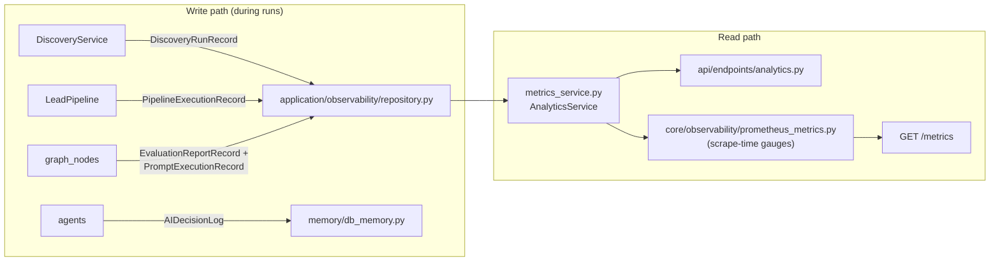

### 12.1 `application/observability/`

| File | Responsibility |
|---|---|
| `models.py` | 4 SQLAlchemy tables: `pipeline_execution_logs` (`pipeline_id` unique, final_status, stage_count, error_count), `evaluation_report_logs` (5 float scores + prompt_version), `prompt_execution_logs` (**written only when source == "llm"**), `discovery_run_logs` (funnel counters per run) |
| `repository.py` | Best-effort writers for the 4 record types (never break the main flow) |
| `metrics_service.py` | `AnalyticsService`: pipeline success rate = SUCCESS-only/total; p95 via `statistics.quantiles(n=100, method="inclusive")[94]`; discovery success = validated/returned; website-resolution rate = resolved_via_fallback/missing_website |

### 12.2 `core/observability/prometheus_metrics.py`

Own private `REGISTRY` (not the global default). Metrics:

| Metric | Type | Labels |
|---|---|---|
| `http_requests_total` | Counter | method, path (route template), status_code |
| `http_request_duration_seconds` | Histogram | method, path |
| `auth_attempts_total` | Counter | result |
| `discovery_runs_total`, `discovery_success_rate_pct`, `discovery_duration_seconds_avg`, `website_resolution_rate_pct`, `pipeline_runs_total`, `pipeline_success_rate_pct`, `pipeline_duration_seconds_avg`, `organizations_total`, `leads_total` | **Gauges refreshed at scrape time** | — |

`route_template` maps concrete URLs to their route pattern to bound label cardinality.
`refresh_periodic_gauges(db, 24h)` runs on every `/metrics` scrape via `render_latest`,
which **swallows refresh failures** so metrics stay available.

---

## 15. Database Schema (ER Diagram)

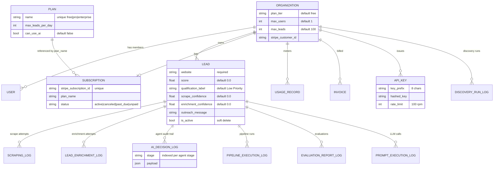

Schema management is `Base.metadata.create_all` at startup — additive only, **no
Alembic**.

---

## 16. Full Per-File Responsibility Table

Every analyzed file in `backend/` (excluding `scripts/` and `tests/`) in one place. `discovery_eval/` is included below since it sits outside `tests/` (its own `tests/` subfolder is excluded, same as everywhere else).

### Root & gateway

| File | Responsibility |
|---|---|
| `main.py` | FastAPI app, lifespan (env validation → init_db ×5 retries → plan seeding; shutdown → scraper cleanup), middleware (request-id/timing, security headers, CORS), health probes, `/metrics`, router registration under `/api/v2` |
| `core/config.py` | `validate_startup_environment()` — fail-fast production checks, warn-only for optional API keys |

### `api/endpoints/`

| File | Responsibility |
|---|---|
| `auth.py` | Register (atomic org+user+default plan), login (JWT pair), refresh, `/me` profile |
| `leads.py` | Lead CRUD + batch create + `POST /{id}/process`; daily-limit enforcement (429); pipeline fan-out via BackgroundTasks |
| `discovery.py` | `POST /discovery/search` — the natural-language entry to `DiscoveryService`; `QueryParseError`→422, other discovery errors→502 |
| `billing.py` | Usage summary, plan list, upgrade (**402 stub**), cancel |
| `analytics.py` | Pipeline / evaluation / discovery metric summaries via `AnalyticsService` |
| `organizations.py` | Organization CRUD with tenant isolation |

### `application/`

| File | Responsibility |
|---|---|
| `discovery/*` (23 files + 5 providers) | See §7 (file map) and §8 (Digital Identity Pipeline deep dive) — parser, providers, resolver, validator, dedup, ranking, service, Sprint 1-4 identity pipeline |
| `workflows/lead_pipeline.py` | LangGraph graph assembly + `execute` + status semantics + `run_lead_pipeline` entry |
| `workflows/graph_nodes.py` | 10 node implementations + `_run_stage` graceful degradation |
| `agents/base.py` | Shared agent machinery (LLM invocation pattern, explanation attachment) |
| `agents/company_intelligence_agent.py` | Industry/tech/ICP analysis; technology grounding filter; heuristic fallback |
| `agents/decision_agent.py` | Qualification→action mapping; conservative LLM reconciliation |
| `agents/messaging_agent.py` | Email + LinkedIn + follow-up generation; template fallback |
| `agents/review_agent.py` | Threshold-only gating (0.75 / 0.45), zero LLM |
| `prompts/registry.py` + `schemas.py` + 3 YAML templates | Versioned prompt store + output schemas |
| `context/context_builder.py` | LeadContext assembly (lead + org + memory + crm stub) |
| `state/lead_state.py` | `LeadState` TypedDict + `DecisionContext` |
| `dto/models.py` | All typed stage-boundary DTOs + `PipelineStatus` |
| `evaluation/evaluators.py` | Deterministic completeness/grounding/consistency/overall scoring |
| `explainability/explainer.py` | `Explanation` DTO builders (deterministic 0.85 / LLM payload) |
| `memory/interfaces.py` + `db_memory.py` | BusinessMemory ABC + SQL implementation over `ai_decision_logs` |
| `interfaces/ports.py` | 6 infrastructure Protocols |
| `services/infra_adapters.py` | The application→core bridge (scrape/enrich/score/message/gating) |
| `services/llm_provider.py` | ChatGroq factory, availability check, `safe_invoke_json` |
| `observability/models.py` + `repository.py` + `metrics_service.py` | 4 run-record tables, best-effort writers, `AnalyticsService` aggregations |
| `exceptions/errors.py` | Application exception hierarchy |
| `utils/retry.py` + `stage_logger.py` | Retry decorator; stage timing/logging span |
| `dependencies.py` | Unused `get_lead_pipeline` DI provider (gap) |

### `discovery_eval/`

| File | Responsibility |
|---|---|
| `queries.py` | ~100 fixed benchmark queries (id, query, domain tag, difficulty tag) |
| `run_eval.py` | Runner -- drives `DiscoveryService`'s own internal stage methods as a black box, no DB writes, no quota spend |
| `metrics.py` | `QueryRecord`/`BusinessRecord` extraction + `aggregate_metrics()` -- reads Discovery's own computed values, never recomputes them |
| `report.py` | CSV / JSON / Markdown report writers |
| `charts.py` | 4 `matplotlib` PNGs: latency, confidence, validation success, provider performance |

### `core/`

| File | Responsibility |
|---|---|
| `domain/models/*` (6 files) | SQLAlchemy tables: users, organizations, leads (+3 log tables), plans, subscriptions, usage/invoices, api_keys |
| `domain/schemas/*` (5 files) | Pydantic request/response contracts |
| `domain/services/scoring.py` | Deterministic weighted lead scoring + Hot/Warm/Cold/Disqualified classification |
| `infrastructure/auth/security.py` | bcrypt+pbkdf2 hashing, JWT issue/verify, `get_current_user` chain, api-key stub |
| `infrastructure/billing/subscription_service.py` | Plan gating (daily limits, AI/export flags), plan seeding, assign/cancel |
| `infrastructure/billing/stripe_service.py` | Stripe SDK wrapper — partially wired (see §20) |
| `infrastructure/database/__init__.py` | Engine, pool, `SessionLocal`, `init_db`, `get_db` |
| `infrastructure/database/crud.py` | All raw ORM queries (single query surface) |
| `infrastructure/enrichment/enricher.py` | 3-tier WaterfallEnricher |
| `infrastructure/scraping/scraper.py` | 6-tier TieredScraper + browser pool + resource cleanup |
| `infrastructure/normalization/normalizer.py` | Scraped-field normalization (additive) |
| `infrastructure/messaging/messenger.py` | Outreach text generation (LLM/template), never sends |
| `infrastructure/logging/__init__.py` | JSON structured logging setup + helpers |
| `infrastructure/workers/orchestrator.py` | Dormant Celery app |
| `observability/prometheus_metrics.py` | Prometheus registry, counters/histogram, scrape-time gauges |

---

## 17. Inter-File Dependency Map

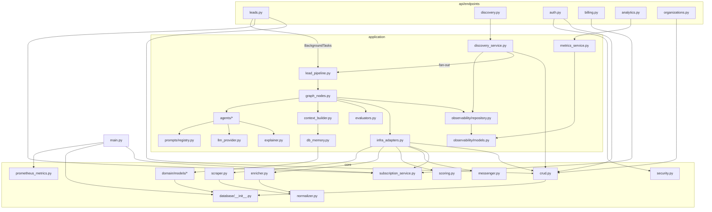

Key invariants (verified in code):

- **`api` never imports `core.infrastructure` scraping/enrichment directly** — only
  through `application`.
- **`application` reaches infrastructure only via `services/infra_adapters.py`**
  (plus `crud.py` for reads/writes).
- **`core` never imports `application` or `api`** — dependency direction is one-way.
- The LLM boundary is concentrated in `llm_provider.py` (+ enricher Tier 3 and
  messenger, which construct ChatGroq themselves).

---

## 18. Testing Layout — `tests/`

`pytest.ini` sets `testpaths = tests`, so **only `pytest` invoked with no path argument** is
restricted to `tests/`; CI (`.github/workflows/ci.yml`) always passes explicit paths, so this
only matters for a bare local `pytest` run.

```
tests/
├── application/
│   ├── conftest.py                 -- shared fixtures (env defaults, no autouse side effects)
│   ├── discovery/                   -- ALL Discovery unit tests, MVP + Sprint 1-4, live here
│   │   ├── fakes.py                  -- shared fakes for the MVP-pipeline tests
│   │   ├── test_discovery_api.py, test_discovery_service.py, test_discovery_full_integration.py
│   │   ├── test_query_parser.py, test_business_normalizer.py, test_duplicate_detector.py
│   │   ├── test_website_resolver.py, test_website_validator.py, test_http_utils.py
│   │   ├── test_overpass_provider.py, test_serper_provider.py, test_brave_provider.py
│   │   ├── test_ranking.py                        -- black-box: overall score comparisons
│   │   ├── test_ranking_identity_signals.py         -- white-box: internal scoring helpers (Sprint 4)
│   │   └── test_canonicalization.py, test_competition.py, test_confidence.py,
│   │       test_digital_identity.py, test_dto_discovered_business.py, test_evidence.py,
│   │       test_false_positive.py, test_features.py, test_identity.py,
│   │       test_identity_resolution_engine.py, test_organization.py, test_reliability.py,
│   │       test_sprint3_backward_compatibility.py, test_verification.py,
│   │       test_website_resolver_evidence.py          -- Sprint 1-4 unit tests
│   └── ... (billing, observability, organization isolation, etc.)
├── infrastructure/
│   └── test_scraper.py              -- pytest-shaped, collected and run normally
└── scraper/
    ├── test_orchestration.py, test_parsing.py, test_playwright.py   -- standalone dev scripts,
    │   NOT pytest-shaped (asyncio.run at import time, print()-based pass/fail counters,
    │   expect `import scraper as S` with scraper.py on sys.path) -- intentionally
    │   `--ignore`d by CI (§6.9), not broken by anything in this change
```

**Why the 16 Sprint 1-4 test files live in `tests/application/discovery/` and not inside
`application/discovery/` itself:** `pytest.ini`'s `testpaths = tests` only reaches files under
`tests/`. They were originally written under `application/discovery/tests/` alongside the source
they cover, which is a completely reasonable layout in general — but it meant CI's
`pytest tests/ discovery_eval/tests/ ...` invocation (§6.9) never collected them at all. Moving
them here was the single change that made every Sprint 1-4 test actually run in CI; the test code
itself needed no changes (no fixtures, no relative imports — every one of the 16 files uses only
absolute `application.discovery.*` imports and takes no pytest fixture arguments).

`test_ranking.py` (pre-existing, black-box: compares overall scores between two businesses) and
the new Sprint 4 `test_ranking.py` (white-box: exercises `ranking.py`'s internal `_contact_
completeness_score`, `_domain_brand_score`, etc. helpers directly) had the same filename; the
Sprint 4 file was renamed to `test_ranking_identity_signals.py` on the move so both run —
strictly more coverage, nothing dropped.

`discovery_eval/tests/` (§9) deliberately stays **outside** `tests/` entirely: it's the evaluation
package's own self-contained test suite (same convention as `scripts/test_scraper.py`, a
standalone script kept beside the code it tests rather than under `tests/`), which is why CI names
it explicitly as a second path rather than moving it too.

---
## 19. Diagram Tooling — Why SVG Instead of Mermaid for Large Diagrams

This document still uses **Mermaid** for every diagram that was already small-to-medium (the
layered architecture in §2, the per-workflow flowcharts and sequence diagram in §6, the ER diagram
in §15) — GitHub renders those natively, they're easy to hand-edit inline, and they diff cleanly
in a PR. But §8's two new diagrams (a 25+ node module dependency graph, and a full pipeline data
flow across 12 modules) are pre-rendered **SVG files** committed under `docs/diagrams/` instead,
referenced with a plain Markdown image tag. That split is deliberate:

### 19.1 Where Mermaid-on-GitHub breaks down at scale

- **No manual layout control.** Mermaid's auto-layout engine does fine with a dozen nodes; past
  that it starts producing long diagonal crossing edges and uneven spacing with no way to nudge
  individual nodes, because you're not choosing positions, you're choosing graph *structure* and
  hoping the layout engine agrees.
- **Fixed render box.** GitHub renders a Mermaid block at a size derived from the diagram's own
  computed dimensions, inside the normal reading column width. A 25-node graph gets squeezed into
  that box — text shrinks, edges overlap, and while GitHub's viewer does support a click-to-zoom
  overlay, it's an extra click before a reader sees anything legible, and it doesn't help someone
  reading the file in an IDE preview, a PR diff view, or a non-GitHub Markdown renderer at all.
- **All-or-nothing rendering.** If GitHub's Mermaid parser trips on any construct in a large,
  complex diagram, the whole block falls back to a raw text dump — there's no partial degradation.
- **No native "open full size."** A static image can be opened in a new tab at full native
  resolution, or the SVG's own vector data can be zoomed losslessly by the browser. A Mermaid
  block has neither.

### 19.2 What to use instead, by need

| Need | Recommendation |
|---|---|
| Big architecture / dependency graphs (10+ nodes), hierarchical | **Graphviz (`dot`)** — what §8's two diagrams use. Excellent automatic hierarchical layout, full styling control via DOT, renders straight to SVG, `dot` ships in `apt`/most CI images already |
| Same, but you want a nicer modern syntax to hand-write | **D2** (`terrastruct/d2`) — text-based like Mermaid, but purpose-built to export crisp static SVG/PNG rather than render live in a chat/markdown widget; handles larger graphs more gracefully than Mermaid's layout engine |
| Hand-tuned layouts where exact node position matters | **draw.io / diagrams.net** — design visually, export SVG/PNG; GitHub can also open `.drawio` files for future editing if you commit the source file alongside the exported image |
| Formal C4-model / enterprise architecture diagrams | **Structurizr** or **C4-PlantUML** |
| Diagrams that must stay small enough for Mermaid to still be worth it | Keep Mermaid — it's still the right tool for the sequence/flowcharts in §6 and the ER diagram in §15 |

The common thread: **for anything that's outgrown Mermaid, render it to a static SVG file and
commit the image**, rather than trying to force GitHub's live Mermaid renderer to cope with a
diagram it wasn't sized for.

### 19.3 How §8's two diagrams were built (and how to regenerate them)

Graphviz was already available in this environment (`dot -V` → 2.43.0), so no new tooling
dependency was introduced. Source files:

```
docs/diagrams/
├── discovery_module_dependency_graph.dot   -- §8.2's diagram
├── discovery_module_dependency_graph.svg    -- rendered output, what the doc actually embeds
├── digital_identity_pipeline_flow.dot        -- §8.3's diagram
└── digital_identity_pipeline_flow.svg         -- rendered output
```

To regenerate either one after editing the `.dot` source:

```bash
cd backend/docs/diagrams
dot -Tsvg discovery_module_dependency_graph.dot -o discovery_module_dependency_graph.svg
dot -Tsvg digital_identity_pipeline_flow.dot -o digital_identity_pipeline_flow.svg
```

Both `.dot` files are plain text and diff cleanly in a PR, same as a Mermaid block would — the
only difference from Mermaid is a one-command render step before the SVG is committed, in
exchange for a diagram that stays legible at any size on GitHub, in an IDE, or opened directly.

### 19.4 Installing Graphviz

The `dot` command is a separate binary from Python/Node — installing the `graphviz` **Python**
package alone (`pip install graphviz`) is not enough, it's just a thin wrapper that still shells
out to the real `dot` executable. Install the actual binary:

| Environment | Command |
|---|---|
| WSL2 / native Ubuntu / Debian | `sudo apt-get update && sudo apt-get install -y graphviz` |
| macOS (Homebrew) | `brew install graphviz` |
| Native Windows | `choco install graphviz` (Chocolatey), or download the installer from `graphviz.org/download/` and add its `bin/` folder to `PATH` |
| Verify (any platform) | `dot -V` → should print `dot - graphviz version 2.4x.x` |

Given your `git status` output from earlier shows you working inside WSL2 Ubuntu
(`DESKTOP-DTDQP40`, `.venv` under `/mnt/g/DEV/projects/LeadBoost-saas-github`), the first row
applies to you — run `sudo apt-get install -y graphviz` once inside that WSL shell (not inside
the Python venv — it's a system package, not a pip package), then the `dot -Tsvg ...` commands
in §19.3 will work directly from your existing terminal.

### 19.5 Keeping large diagrams a reasonable size

A hand-written `.dot` file with generous `nodesep`/`ranksep` can lay out to a huge canvas once
Graphviz has 25+ nodes to place — the two diagrams above originally rendered at roughly
2860×2220pt and 5290×520pt respectively, which is far wider than a GitHub content column, so
the default inline preview would shrink to illegibly small before any zoom. Two independent
fixes, both used here:

1. **Cap the physical canvas** with the graph attributes `size="15,11!"` (max width/height in
   inches — the `!` forces Graphviz to actually shrink to fit rather than only using it as a
   suggestion) and `ratio=compress` (repacks node spacing to fit that box, rather than just
   rescaling after the fact — this is what took the dependency graph from ~2860×2220pt down to
   ~980×790pt without losing any node or edge). Add these two lines inside the `graph [ ... ]`
   block at the top of the `.dot` file, right next to `rankdir`.
2. **Constrain the *display* width independently of the file's own dimensions**, via the
   `` HTML embed used in §8.2/§8.3 above, wrapped in an `<a href="...">` pointing
   at the same file — GitHub renders the HTML `width` attribute directly (plain Markdown
   `` image syntax has no way to set this), so the inline preview is a predictable, readable
   size regardless of the SVG's native dimensions, and clicking it opens the full file at full
   resolution in a new tab. `width="900"` is a reasonable default for a document with normal-width
   prose around it — drop it lower (e.g. `600`) for a narrower page, or raise it if the diagram
   still reads as cramped.

If a diagram is complex enough that even a capped/compressed layout is still hard to follow at
any single size, the better fix is usually to split it into two smaller diagrams along its
natural seams (e.g. §8.3's pipeline could split into "raw signal → BusinessIdentity" and
"BusinessIdentity → VerifiedDigitalIdentity") rather than continuing to shrink the same
25-node diagram — a diagram that needs a magnifying glass to read is a diagram that's trying to
show too much in one image, independent of file format.

---
## 20. Known Gaps & Intentional Stubs

All verified in code — useful when extending the system:

| # | Gap / stub | Location |
|---|---|---|
| 1 | `get_lead_pipeline` DI provider exists but no endpoint uses it (endpoints call `run_lead_pipeline` directly) | `application/dependencies.py` |
| 2 | Billing upgrade returns **402 "Online payments coming soon."** — no real payment flow; no prices defined anywhere | `api/endpoints/billing.py` |
| 3 | Stripe webhook handlers for payment succeeded/failed are `pass`; metered usage commented out; placeholder price→plan map; **no webhook route registered** | `core/infrastructure/billing/stripe_service.py`, `main.py` |
| 4 | `verify_api_key` matches by 8-char prefix only — full-hash verification is an explicit TODO | `core/infrastructure/auth/security.py` |
| 5 | Subscription Pydantic schema (`plan_id`, `is_active`) mismatches the ORM (`plan_name`, `status`) | `core/domain/schemas/subscription.py` |
| 6 | Celery orchestrator is dormant — zero imports; pipeline runs in-process via BackgroundTasks | `core/infrastructure/workers/orchestrator.py` |
| 7 | Enrichment Tier 2 (external API) is a placeholder that always returns `None` | `core/infrastructure/enrichment/enricher.py` |
| 8 | `brave_provider.py` exists but is superseded by Overpass + Serper in the active discovery flow | `application/discovery/providers/brave_provider.py` |
| 9 | No Alembic migrations — schema managed by `create_all` (additive only) | `core/infrastructure/database/__init__.py` |
| 10 | `crm_history` in LeadContext is an always-empty extension point | `application/context/context_builder.py` |
| 11 | Per-organization scoring configuration methods are stubs; `ScoringModelType` has unused variants | `core/domain/services/scoring.py` |
| 12 | Messenger only generates outreach text — no email/LinkedIn sending exists anywhere | `core/infrastructure/messaging/messenger.py` |
| 13 | `CAN_USE_AI_*` defaults are all `"false"` — AI enrich/messaging stages are skipped unless env explicitly enables them | `core/infrastructure/billing/subscription_service.py` |
| 14 | `DiscoveredBusiness.identity` (`VerifiedDigitalIdentity`) never reaches the API layer -- `DiscoveryResponse` / `LeadCreationOutcome` expose no identity/quality/risk fields, so a client can't see *why* a business ranked where it did | `application/discovery/dto.py` |
| 15 | `identity.py`'s legacy `FeatureName`/`extract_features()` path still runs per candidate group but only feeds a secondary `identity_verification` cross-check -- `BusinessIdentity.confidence` itself comes entirely from the newer `features.py`/`confidence.py` engines | `application/discovery/identity.py` |
| 16 | Most `EvidenceType` (7 of 15) and `RelationshipType` (6 of 9) members are defined but never constructed -- reserved for signals (schema.org, OpenGraph, contact-page presence) that need real page HTML only LeadPipeline's scrape downloads, which Discovery doesn't have at search time | `application/discovery/evidence.py`, `organization.py` |
| 17 | `discovery_eval` is never wired into CI as a live benchmark (only its own unit tests are, §9/§18) -- running the ~100-query benchmark against production providers is a manual/on-demand step, not a merge gate | `discovery_eval/run_eval.py` |
| 18 | `ranking.py`'s three purely name/rating/review-derived signals (category match, rating, review count = 40 of 135 points) have no `VerifiedDigitalIdentity` equivalent yet -- only 5 of 8 scoring components are identity-aware | `application/discovery/ranking.py` |

---

*Generated from direct source analysis. Companion docs: `ARCHITECTURE.md`,
`DISCOVERY.md`, `MONITORING.md`, `ENVIRONMENT.md` in this folder.*